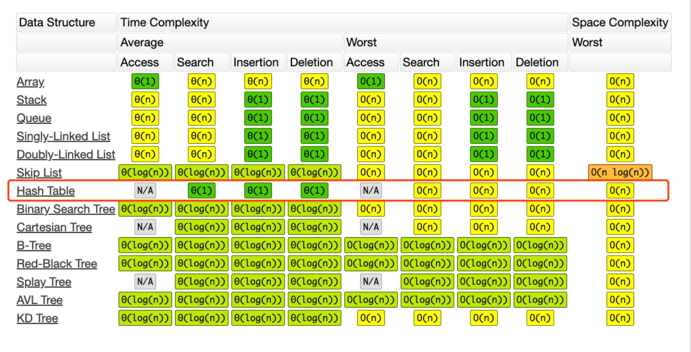

# 毕业总结

## 数据结构与算法总览

### 一维

- 基础：数组(移动零、三数之和)、链表(链表本身对应的算法题不难，需注意细节处理)

- 高级：栈(括号匹配、DFS)、队列(BFS)、堆(二叉堆)、双端队列(滑动窗口)、集合(数组去重)、字典(计数、与双链表组合实现 LRU)

### 二维

- 树(注意其递归特性、前、中、后序遍历的递归、迭代解法需在 O(1) 时间内快速写出)、图(遍历时注意使用 visited 标记已访问过的元素)

- 二叉搜索树(中序遍历为递增，左子树小于根，右子树大于根，对子树同理)，为了保持二叉搜索树尽可能的平衡，由此引申出 AVL(注意其左旋、右旋、左右旋、右左旋操作)、红黑树(注意其红黑特性)、并查集(朋友圈、账户合并)、字典树(在二维字符矩阵中搜索单词库中的单词)

### 特殊

- 位运算、布隆过滤器

- LRU (哈希表 + 双向链表)

###  各种数据结构时间复杂度总览



### 算法思想

- if-else、switch

- for、while loop

- 递归(O(1) 出模板)、分治(归并排序)、回溯(全排列、N 皇后)

- 搜索：BFS、DFS、A*

- 动态规划(打家劫舍、股票买卖、编辑距离、零钱兑换、爬楼梯)

- 二分查找(搜索旋转数组、搜索有重复元素的排序数组中元素的第一个和最后一个位置)

- 贪心

### 五毒神掌

#### 第一遍

- 5 分钟：读题 + 思考

- 直接看题解：先 BFS，再 DFS，找到自己觉得最合适的题解深度学习

- 背诵、默写好的解法，要敢于背诵代码

#### 第二遍

- 马上自己写，LeetCode 提交

- 多解法比较，体会优化

#### 第三遍

- 一天之后，重复做题

- 针对不同解法专项练习

#### 第四遍

- 一周之后，回来反复练习相同题目

#### 第五遍

- 面试前一周恢复性训练

### 刷题方法

- Clarification

- Possible solutions

- Coding

- Test cases

## 数组、链表、跳表

### 时间复杂度

**数组**

操作|时间复杂度
-------|-------
插入|O(n)
查找|O(1)
删除|O(n)
修改|O(1)

**链表**

操作|时间复杂度
-------|-------
插入|O(n)
查找|O(n)
删除|O(1)
修改|O(n)

**跳表**

操作|时间复杂度
-------|-------
插入|O(n)
查找|O(logn)
删除|O(1)
修改|O(logn)

## 栈、队列、优先队列、双端队列

- 栈：先入后出；添加、删除皆为 O(1)

- 队列：先入先出；添加、删除皆为 O(1)

- 双端队列：两端可以进出的队列；添加、删除皆为 O(1)

## Map、Set

- Map：key-value 对，key 不重复

- Set：不重复元素的集合

## 树、二叉树、二叉搜索树、堆、二叉堆

### 二叉树的遍历

- 前序(Pre-order)：根 - 左 - 右

- 中序(In-order)：左 - 根 - 右

- 后序(Post-order)：左 - 右 - 根

- 层序(Level-order)：按层遍历

**代码模板**

```python
def preorder(self, root): 
	if root: 
		self.traverse_path.append(root.val) 
		self.preorder(root.left) 
		self.preorder(root.right)
		
def inorder(self, root):
	if root: 
		self.inorder(root.left) 
		self.traverse_path.append(root.val) 
		self.inorder(root.right)
		
def postorder(self, root):
	if root: 
		self.postorder(root.left) 
		self.postorder(root.right) 
		self.traverse_path.append(root.val)
```

<font color="Red">
注意：</br>
一定要牢记该模板，很多回溯、分治最终也可从该模板引申出来，归并排序，不就是树的后序遍历吗？快速排序，不就是树的前序遍历吗？
</font> 

### 二叉搜索树

二叉搜索树，也称二叉排序树、有序二叉树（Ordered Binary Tree）、排序二叉树（Sorted Binary Tree），是指一棵空树或者具有下列性质的二叉树：

1. 左子树上所有结点的值均小于它的根结点的值；
2. 右子树上所有结点的值均大于它的根结点的值；
3. 以此类推：左、右子树也分别为二叉查找树。 （这就是 重复性！）

中序遍历：升序排列

### 堆

堆，是一种数据接口，实现堆的方式有很多，较常见的有二叉堆、二项式堆、斐波那契堆

### 二叉堆

二叉堆，是一颗完全二叉树，使用数组实现：

- 设父节点编号为 `i`，则其左孩子编号为 `2*i + 1`，右孩子编号为 `2*i+2`

- 设孩子节点编号为 `i`，则其父节点编号为 `(i - 1)/2`

## 递归

### 盗梦空间

- 向下进入到不同梦境中；向上又回到原来一层

- 通过声音同步回到上一层

- 每一层的环境和周围的人都是一份拷贝、 主角等几个人穿越不同层级的梦境（发生和携带变化）

**代码模板**

```java
public void recur(int level, int param) {
	// terminator 
	if (level > MAX_LEVEL) {
	// process result 
	 return; }
	// process current logic 
	 process(level, param);
	// drill down 
	 recur( level: level + 1, newParam);
	// restore current status 
}
```

## 分治、回溯

### 分治代码模板

```python
def divide_conquer(problem, param1, param2, ...): 
	# recursion terminator 
	if problem is None: 
	 print_result 
	return
	# prepare data 
	 data = prepare_data(problem) 
	 subproblems = split_problem(problem, data) 
	# conquer subproblems 
	 subresult1 = self.divide_conquer(subproblems[0], p1, ...) 
	 subresult2 = self.divide_conquer(subproblems[1], p1, ...) 
	 subresult3 = self.divide_conquer(subproblems[2], p1, ...) 
	...
	# process and generate the final result 
	 result = process_result(subresult1, subresult2, subresult3, …) 
	# revert the current level states
```

第一时间想到归并排序

### 回溯

回溯法采用试错的思想，它尝试分步的去解决一个问题。在分步解决问题的过程中，当它通过尝试发现现有的分步答案不能得到有效的正确的解答的时候，它将取消上一步甚至是上几步的计算，再通过其它的可能的分步解答再次尝试寻找问题的答案。

回溯法通常用最简单的递归方法来实现，在反复重复上述的步骤后可能出现两种情况：

- 找到一个可能存在的正确的答案；

- 在尝试了所有可能的分步方法后宣告该问题没有答案。

在最坏的情况下，回溯法会导致一次复杂度为指数时间的计算。

**代码模板**

```python
result = []
def backtrack(路径, 选择列表):
    if 满足结束条件:
        result.add(路径)
        return

    for 选择 in 选择列表:
        做选择
        backtrack(路径, 选择列表)
        撤销选择
```

## 深度优先搜索和广度优先搜索

### 深度优先搜索代码模板

非递归写法

```python
def DFS(self, tree): 
	if tree.root is None: 
		return [] 
		
	 visited, stack = [], [tree.root] 
	 
	while stack: 
		 node = stack.pop() 
		 visited.add(node) 
		 
		 process (node) 
		 nodes = generate_related_nodes(node) 
		 stack.push(nodes) 
	# other processing work 
	...
```

递归写法

```python
visited = set() 

def dfs(node, visited): 
	 visited.add(node) 
	 
	# process current node here. 
	...
	for next_node in node.children(): 
		if not next_node in visited: 
			 dfs(next node, visited)
```

### 广度优先搜索代码模板

```python
def BFS(graph, start, end): 
	 queue = [] 
	 queue.append([start]) 
	 visited.add(start) 

	while queue: 
		 node = queue.pop() 
		 visited.add(node) 
 
		 process(node) 
		 nodes = generate_related_nodes(node) 
		 queue.push(nodes) 
		 
	# other processing work 
	...
```

## 贪心算法

### 概述

贪心算法是一种在每一步选择中都采取在当前状态下最好或最优（即最有
利）的选择，从而希望导致结果是全局最好或最优的算法。 

贪心算法与动态规划的不同在于它对每个子问题的解决方案都做出选择，不能回退。动态规划则会保存以前的运算结果，并根据以前的结果对当前进行选择，有回退功能。

贪心法可以解决一些最优化问题，如：求图中的最小生成树、求哈夫曼编码等。然而对于工程和生活中的问题，贪心法一般不能得到我们所要求的答案。
 
一旦一个问题可以通过贪心法来解决，那么贪心法一般是解决这个问题的最好办法。由于贪心法的高效性以及其所求得的答案比较接近最优结果，贪心法也可以用作辅助算法或者直接解决一些要求结果不特别精确的问题。

###  适用贪心算法的场景

简单地说，问题能够分解成子问题来解决，子问题的最优解能递推到最终
问题的最优解。这种子问题最优解称为最优子结构。

贪心算法与动态规划的不同在于它对每个子问题的解决方案都做出选择，
不能回退。动态规划则会保存以前的运算结果，并根据以前的结果对当前
进行选择，有回退功能。

## 二分查找

### 二分查找的前提

1. 目标函数单调性（单调递增或者递减）

2. 存在上下界（bounded）

3. 能够通过索引访问（index accessible)

### 代码模板

```python
left, right = 0, len(array) - 1
while left <= right:
	 mid = (left + right)/2
	if array[mid] == target: 
		# find the target!! 
		break or return result 
	elif array[mid] < target:
		 left = mid + 1
	else:
		 right = mid - 1
```

## 动态规划

动态规划 和 递归或者分治 没有根本上的区别（关键看有无最优的子结构） 

共性：找到重复子问题

差异性：最优子结构、中途可以淘汰次优解

**动态规划三步曲**

1. 寻找重复子问题

2. 定义状态数组，非常重要，有时需要升维来解决问题，如股票买卖，可以借助二维的股票持有状态、三维的天数信息来解决

3. 推导状态转移方程

## 字典树与并查集

### 字典树概念

字典树，即 Trie 树，又称单词查找树或键树，是一种树形结构。典型应用是用于统计和排序大量的字符串（但不仅限于字符串），所以经常被搜索引擎系统用于文本词频统计。 

它的优点是：最大限度地减少无谓的字符串比较，查询效率比哈希表高。

### 字典树基本性质

1. 结点本身不存完整单词；

2. 从根结点到某一结点，路径上经过的字符连接起来，为该结点对应的
字符串；

3. 每个结点的所有子结点路径代表的字符都不相同。

### 字典树核心思想

Trie 树的核心思想是空间换时间。

利用字符串的公共前缀来降低查询时间的开销以达到提高效率的目的。

### 字典树代码模板

```python
class Trie(object): 

	def __init__(self): 
		 self.root = {} 
		 self.end_of_word = "#"

	def insert(self, word): 
		node = self.root 
		for char in word: 
			 node = node.setdefault(char, {}) 
		node[self.end_of_word] = self.end_of_word 

	def search(self, word): 
		node = self.root 
		for char in word: 
			if char not in node: 
				return False 
			node = node[char] 
		return self.end_of_word in node 

	def startsWith(self, prefix): 
		node = self.root 
		for char in prefix: 
			if char not in node: 
				return False 
			 node = node[char] 
		return True
```

### 并查集适用场景

- 组团、配对问题

- Group or not ?

### 并查集基本操作

- makeSet(s)：建立一个新的并查集，其中包含 s 个单元素集合。

- unionSet(x, y)：把元素 x 和元素 y 所在的集合合并，要求 x 和 y 所在
的集合不相交，如果相交则不合并。

- find(x)：找到元素 x 所在的集合的代表，该操作也可以用于判断两个元
素是否位于同一个集合，只要将它们各自的代表比较一下就可以了。

### 并查集代码模板

```swift
class UnionFind {
    private var count: Int = 0
    private var parent: [Int]
    
    init(_ n: Int) {
        count = n
        parent = [Int](repeating: 0, count: n)
        for i in 0 ..< n {
            parent[i] = i
        }
    }
    
    func find(_ p: Int) -> Int {
        var x = p
        while x != parent[x] {
            // 路径压缩
            parent[x] = parent[parent[x]]
            x = parent[x]
        }
        return x
    }
    
    func union(_ p: Int, _ q: Int) {
        let rootP = find(p)
        let rootQ = find(q)
        if rootP == rootQ {
            return
        }
        parent[rootP] = rootQ
        count -= 1
    }
    
    func getCount() -> Int {
        return count
    }
    
    func connected(_ p: Int, _ q: Int) -> Bool {
        let rootP = find(p)
        let rootQ = find(q)
        return rootP == rootQ
    }
}
```

##  高级搜索

- 剪枝

- 双向 BFS

- A*

## 红黑树和 AVL 树

### AVL 树

1. 发明者 G. M. Adelson-Velsky和 Evgenii Landis

2. Balance Factor（平衡因子）：
是它的左子树的高度减去它的右子树的高度（有时相反）。
balance factor = {-1, 0, 1}

3. 通过旋转操作来进行平衡（四种）

4. https://en.wikipedia.org/wiki/Self-balancing_binary_search_tree

### 旋转操作

1. 左旋

2. 右旋

3. 左右旋

4. 右左旋

### AVL 特性

1. 平衡二叉搜索树

2. 每个结点存 balance factor = {-1, 0, 1}

3. 四种旋转操作

不足：结点需要存储额外信息、且调整次数频繁

### 红黑树

红黑树是一种近似平衡的二叉搜索树（Binary Search Tree），它能够确保任何一个结点的左右子树的高度差小于两倍。具体来说，红黑树是满足如下条件的二叉搜索树：

- 每个结点要么是红色，要么是黑色
- 根结点是黑色
- 每个叶结点（NIL结点，空结点）是黑色的。
- 不能有相邻接的两个红色结点 
-  从任一结点到其每个叶子的所有路径都包含相同数目的黑色结点。

### 红黑树最关键性质

从根到叶子的最长的可能路径不多于最短的可能路径的两倍长。

### 红黑树与 AVL 树对比

- AVL trees provide faster lookups than Red Black Trees because they are more strictly balanced.  

- Red Black Trees provide faster insertion and removal operations than AVL trees as fewer rotations are done due to relatively relaxed balancing.

- AVL trees store balance factors or heights with each node, thus requires storage for an integer per node whereas Red Black Tree requires only 1 bit of information per node.

- Red Black Trees are used in most of the language libraries 
like map, multimap, multiset in C++ whereas AVL trees are used in databases where faster retrievals are required.

##  位运算

### 异或

x ^ 0 = x

x ^ 1s = ~x // 注意 1s = ~0

x ^ (~x) = 1s

x ^ x = 0

c = a ^ b => a ^ c = b, b ^ c = a // 交换两个数

a ^ b ^ c = a ^ (b ^ c) = (a ^ b) ^ c // associative

### 指定位置的位运算

1. 将 x 最右边的 n 位清零：x & (~0 << n)

2. 获取 x 的第 n 位值（0 或者 1）： (x >> n) & 1

3. 获取 x 的第 n 位的幂值：x & (1 << n)

4. 仅将第 n 位置为 1：x | (1 << n)

5. 仅将第 n 位置为 0：x & (~ (1 << n))

6. 将 x 最高位至第 n 位（含）清零：x & ((1 << n) - 1)

### 实战要点

- 判断奇偶：

	x % 2 == 1 —> (x & 1) == 1</br>
	x % 2 == 0 —> (x & 1) == 0

- x >> 1 —> x / 2. 

	即： x = x / 2; —> x = x >> 1;</br>
		mid = (left + right) / 2; —> mid = (left + right) >> 1;

- X = X & (X-1) 清零最低位的 1 

- X & -X => 得到最低位的 1 

- X & ~X => 0

### 布隆过滤器

一个很长的二进制向量和一系列随机映射函数。布隆过滤器可以用于检索
一个元素是否在一个集合中。 

优点是空间效率和查询时间都远远超过一般的算法， 缺点是有一定的误识别率和删除困难。

**案例**

1. 比特币网络

2. 分布式系统（Map-Reduce） — Hadoop、search engine

3. Redis 缓存

4. 垃圾邮件、评论等的过滤

## 排序

```swift
/**
 冒泡排序
 
 1 比较相邻的元素。如果第一个比第二个大，就交换它们两个；
 2 对每一对相邻元素作同样的工作，从开始第一对到结尾的最后一对，这样在最后的元素应该会是最大的数；
 3 针对所有的元素重复以上的步骤，除了最后一个；
 4 重复步骤1~3，直到排序完成
 */
func bubbleSort(_ arr: inout [Int]) {
    let n = arr.count
    for i in 0 ..< n - 1 {
        for j in 0 ..< n - 1 - i {
            if arr[j] > arr[j + 1] {
                let temp = arr[j]
                arr[j] = arr[j + 1]
                arr[j + 1] = temp
            }
        }
    }
}
    
/**
 选择排序
 
 首先在未排序序列中找到最小（大）元素，存放到排序序列的起始位置，然后，再从剩余未排序元素中继续寻找最小（大）元素，然后放到已排序序列的末尾。以此类推，直到所有元素均排序完毕。

 1 初始状态：无序区为R[1..n]，有序区为空；
 2 第i趟排序(i=1,2,3…n-1)开始时，当前有序区和无序区分别为R[1..i-1]和R(i..n）。该趟排序从当前无序区中-选出关键字最小的记录 R[k]，将它与无序区的第1个记录R交换，使R[1..i]和R[i+1..n)分别变为记录个数增加1个的新有序区和记录个数减少1个的新无序区；
 3 n-1趟结束，数组有序化了
 */
func selectSort(_ arr: inout [Int]) {
    let n = arr.count
    for i in 0 ..< n - 1 {
        var minIndex = i
        for j in i + 1 ..< n {
            if arr[j] < arr[minIndex] {
                minIndex = j
            }
        }
        
        if i == minIndex {
            continue
        }
        
        let temp = arr[i]
        arr[i] = arr[minIndex]
        arr[minIndex] = temp
    }
}
    
/**
 插入排序
 
 通过构建有序序列，对于未排序数据，在已排序序列中从后向前扫描，找到相应位置并插入
 
 1 从第一个元素开始，该元素可以认为已经被排序；
 2 取出下一个元素，在已经排序的元素序列中从后向前扫描；
 3 如果该元素（已排序）大于新元素，将该元素移到下一位置；
 4 重复步骤3，直到找到已排序的元素小于或者等于新元素的位置；
 5 将新元素插入到该位置后；
 6 重复步骤2~5
 */
func insertSort(_ arr: inout [Int]) {
    let n = arr.count
    for i in 1 ..< n {
        let curr = arr[i]
        var index = i - 1
        while index >= 0 && arr[index] > curr { // 只挪比 curr 大的
            arr[index + 1] = arr[index]
            index -= 1
        }
        arr[index + 1] = curr
    }
}
    
/**
 希尔排序（Shell Sort）
 
 先将整个待排序的记录序列分割成为若干子序列分别进行直接插入排序，具体算法描述：

 1 选择一个增量序列t1，t2，…，tk，其中ti>tj，tk=1；
 2 按增量序列个数k，对序列进行k 趟排序；
 3 每趟排序，根据对应的增量ti，将待排序列分割成若干长度为m 的子序列，分别对各子表进行直接插入排序。仅增量因子为1 时，整个序列作为一个表来处理，表长度即为整个序列的长度
 */
func shellSort(_ arr: inout [Int]) {
    let n = arr.count
    var gap = n/2
    while gap > 0 {
        for i in gap ..< n {
            var j = i
            let current = arr[i]
            while j - gap >= 0 && current < arr[j - gap] {
                arr[j] = arr[j - gap]
                j -= gap
            }
            arr[j] = current
        }
        gap = gap/2
    }
}
    
/**
 归并排序 - 树的后序遍历
 */
func mergeSort(_ arr: [Int]) -> [Int] {
    if arr.count < 2 {
        return arr
    }
    
    let mid = arr.count >> 1
    let left = Array(arr[0 ..< mid])
    let right = Array(arr[mid ..< arr.count])
    let mergedLeft = mergeSort(left)
    let mergedRight = mergeSort(right)
    return merge(mergedLeft, mergedRight)
}
    
private func merge(_ arrA: [Int], _ arrB: [Int]) -> [Int] {
    var res = [Int]()
    let m = arrA.count, n = arrB.count
    var i = 0, j = 0
    while i < m && j < n {
        if arrA[i] > arrB[j] {
            res.append(arrB[j])
            j += 1
        } else {
            res.append(arrA[i])
            i += 1
        }
    }
    
    while i < m {
        res.append(arrA[i])
        i += 1
    }
    
    while j < n {
        res.append(arrB[j])
        j += 1
    }
    
    return res
}
    
/**
 快速排序 - 树的前序遍历
 */
func quickSort(_ arr: inout [Int]) {
    quickSort(&arr, 0, arr.count - 1)
}
    
private func quickSort(_ arr: inout [Int], _ start: Int, _ end: Int) {
    guard arr.count > 1 && end > start else {
        return
    }
    
    let index = partition(&arr, start, end)
    if index > start {
        quickSort(&arr, start, index - 1)
    }
    if index < end {
        quickSort(&arr, index + 1, end)
    }
}
    
private func partition(_ arr: inout [Int], _ start: Int, _ end: Int) -> Int {
    let pivot = end     // 标杆位置
    var counter = start // 小于 pivot 的元素的个数
    for i in start ..< end {
        if arr[i] < arr[pivot] {    // 所有小于 pivot 的元素交换到 pivot 前面
            swap(&arr, counter, i)
            counter += 1
        }
    }
    
    swap(&arr, counter, pivot)
    return counter
}
    
private func swap(_ arr: inout [Int], _ start: Int, _ end: Int) {
    let temp = arr[start]
    arr[start] = arr[end]
    arr[end] = temp
}

/**
 基数排序是按照低位先排序，然后收集；再按照高位排序，然后再收集；依次类推，直到最高位。有时候有些属性是有优先级顺序的，先按低优先级排序，再按高优先级排序。最后的次序就是高优先级高的在前，高优先级相同的低优先级高的在前。

 10.1 算法描述
 取得数组中的最大数，并取得位数；
 arr为原始数组，从最低位开始取每个位组成radix数组；
 对radix进行计数排序（利用计数排序适用于小范围数的特点）；
 */
func radixSort(_ arr: inout [Int]) -> [Int] {
    let n = arr.count
    guard n > 1 else {
        return arr
    }
            
    // 先获取最大值
    var maxNum = arr[0]
    for i in 1 ..< n {
        maxNum = max(maxNum, arr[i])
    }
            
    var sortedNums = arr
    var buf = [[Int]](repeating: [Int](), count: 10)
    var exp = 1
    while maxNum >= exp {
        for i in 0 ..< n {
            let digit = (sortedNums[i]/exp) % 10
            buf[digit].append(sortedNums[i])
        }
        
        var j = 0
        for i in 0 ..< 10 {
            let arr = buf[i]
            if arr.count > 0 {
                for num in arr {
                    sortedNums[j] = num
                    j += 1
                }
                buf[i].removeAll()
            }
        }
        
        exp *= 10
    }
    
    return sortedNums
}
```