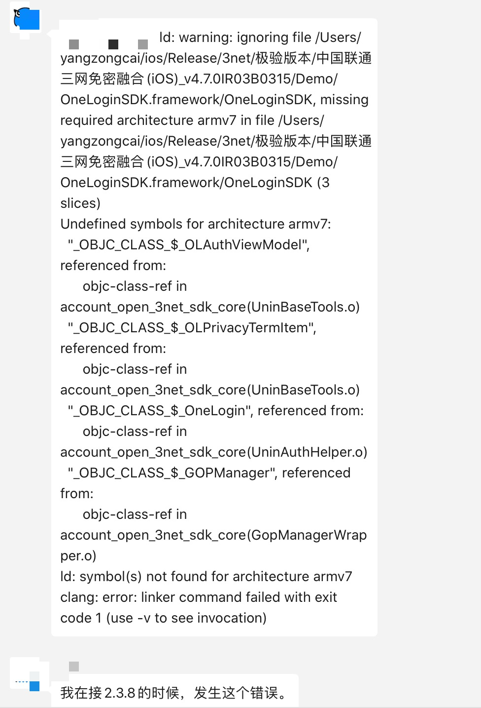
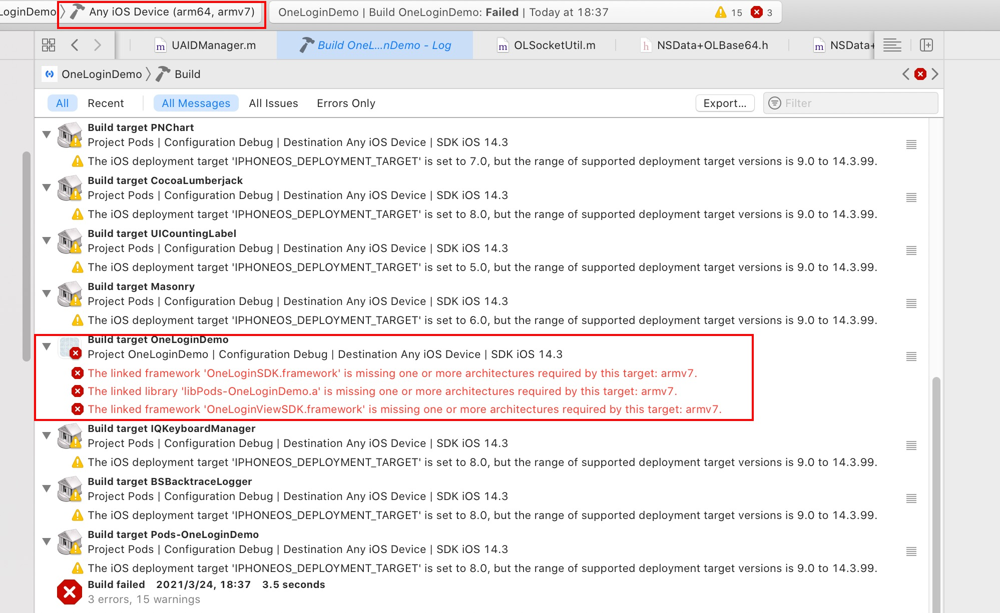

# OneLogin.framework 缺少 armv7 架构问题分析

OneLogin iOS 2.3.8 归档时，发现附件大小比之前缩小了，当时没有引起警觉，直接就传上去了。后面小沃接入 2.3.8 版本时，出现如下错误：



根据日志，可以看出是由于 framework 缺少了 armv7 架构，导致编译不过。果断找到发布到线上的 framework，通过 lipo 查看其支持的架构：

```shell
LiuLiandeiMac:Docs noctis$ lipo -info /Users/noctis/Documents/LiuLian/GeetestPod/OneLogin/SDK/OneLoginSDK.framework/OneLoginSDK
Architectures in the fat file: /Users/noctis/Documents/LiuLian/GeetestPod/OneLogin/SDK/OneLoginSDK.framework/OneLoginSDK are: i386 x86_64 arm64
```

果然没有 armv7 架构，那么为什么会缺少 armv7 架构呢？是因为当前正在使用 Xcode 12，然后脚本编译的时候默认使用了 Xcode 12 去实现的编译吗？

首先，确认下 macOS 当前的默认 Xcode 版本，终端输入如下命令(查看 macOS 当前默认 Xcode 版本或者切换 Xcode 版本，可参考 [Mac 下修改系统默认 Xcode](https://jacobpan3g.github.io/cn/2017/09/01/change-default-xcode/))：

```shell
LiuLiandeiMac:Docs noctis$ xcode-select -p
/Applications/Xcode.app/Contents/Developer
```

切换 macOS 默认的 Xcode 版本命令如下：

```shell
xcode-select -switch /Applications/Xcode.app
```

发现 macOS 当前默认 Xcode 版本是 Xcode 11，并不是 Xcode 12，为了避免干扰，退出 Xcode，重新使用脚本进行编译，编译完成之后，framework 还是缺少 armv7 架构。

于是，祭出了重启大法，重启 macOS，再次使用脚本进行编译。可是，编译出来的 framework，还是没有 armv7 架构。

至此，几乎可以肯定，不是系统环境导致，上个版本 2.3.7 是正常的，从上个版本到这个版本的这段时间内，电脑也一直没有关过，而且重启电脑之后也测试过。推测应该是由于 project 本身的配置导致。

然后，通过 SourceTree 对比 2.3.8 版本与 2.3.7 版本 project 配置有哪些变化。对比后发现，2.3.8 版本为了兼容 Xcode 12 在 Target 选择 Any iOS Device(arm64,armv7) 时编译无法通过的问题，在 Build Settings -> Excluded Architectures 中添加了如下配置：

```
EXCLUDED_ARCHS__EFFECTIVE_PLATFORM_SUFFIX_simulator__NATIVE_ARCH_64_BIT_x86_64=arm64 arm64e armv7 armv7s armv6 armv8 EXCLUDED_ARCHS=$(inherited) $(EXCLUDED_ARCHS__EFFECTIVE_PLATFORM_SUFFIX_$(EFFECTIVE_PLATFORM_SUFFIX)__NATIVE_ARCH_64_BIT_$(NATIVE_ARCH_64_BIT))
``` 

不添加该配置时，编译报错如下：




到这里，就找到问题了，删除该配置后，重新使用脚本编译，就正常了：

```
LiuLiandeiMac:OneLoginSDK noctis$ lipo -info /Users/noctis/Documents/LiuLian/GeetestPod/OneLogin/SDK/OneLoginSDK.framework/OneLoginSDK
Architectures in the fat file: /Users/noctis/Documents/LiuLian/GeetestPod/OneLogin/SDK/OneLoginSDK.framework/OneLoginSDK are: i386 x86_64 armv7 arm64
```

