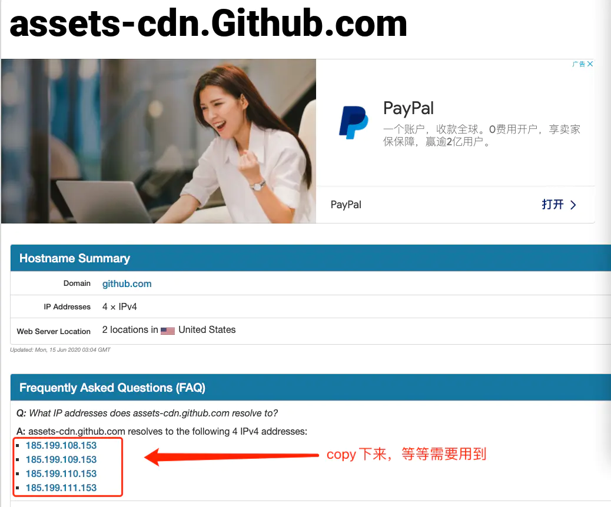

## GitHub 无法访问，443 Operation timed out 的解决办法

1. 打开 [https://github.com.ipaddress.com/](https://github.com.ipaddress.com/) 如下图：

	
	
	把 `ip address` 记录下来。

2. 打开 [https://fastly.net.ipaddress.com/github.global.ssl.fastly.net#ipinfo](https://fastly.net.ipaddress.com/github.global.ssl.fastly.net#ipinfo) 如下图：

	
	
	把 `ip address` 记录下来。
	
3. 打开 [https://github.com.ipaddress.com/assets-cdn.github.com](https://github.com.ipaddress.com/assets-cdn.github.com) 如下图：

	
	
	把 `ip address` 记录下来。
	
4. 打开电脑的 `hosts` 文件，加入如下内容：

	```
	140.82.113.4(图1的IP Address) github.com 
	199.232.69.194(图2的IP Address) github.global.ssl.fastly.net
	185.199.108.153(图3的IP Address)  assets-cdn.github.com
	185.199.109.153(图3的IP Address)  assets-cdn.github.com
	185.199.110.153(图3的IP Address)  assets-cdn.github.com
	185.199.111.153(图3的IP Address)  assets-cdn.github.com
	```
	
5. 保存 `hosts` 文件，在终端执行 `source /etc/hosts` (macOS)

6. 在终端在输以下指令刷新DNS（需要权限）

	```
	sudo killall -HUP mDNSResponder;say DNS cache has been flushed
	```
	
7. 重新执行 `git` 命令连接 `Github`