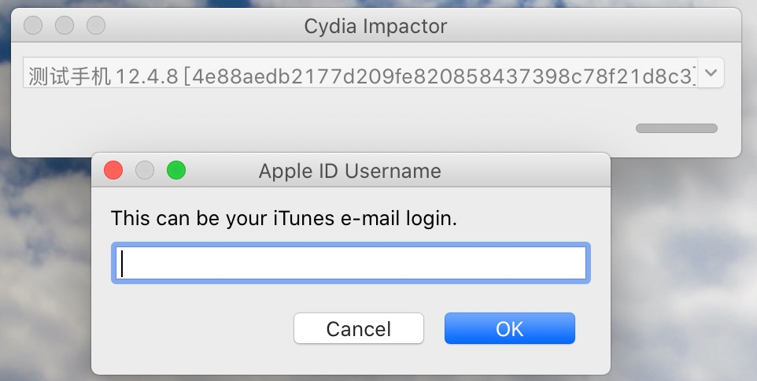
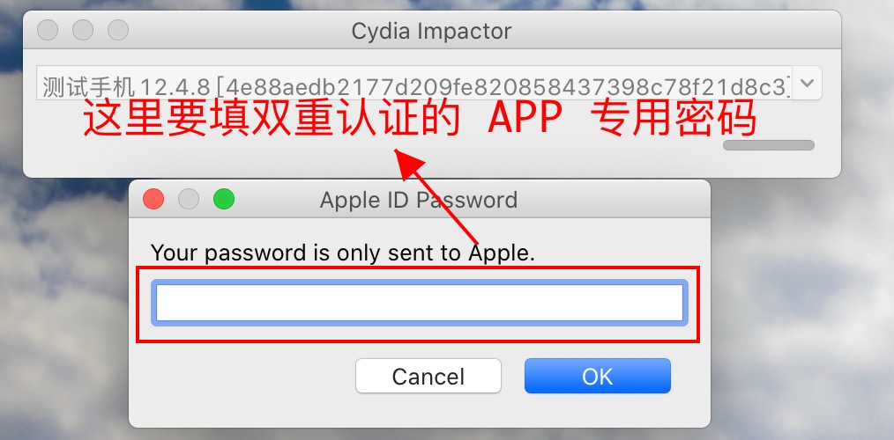
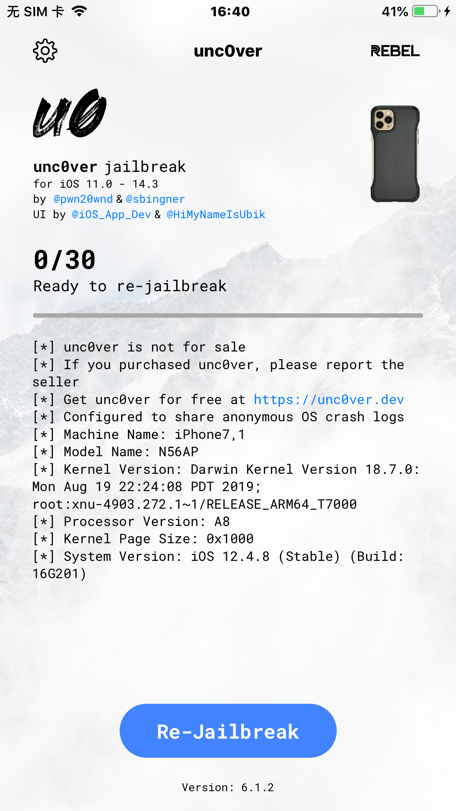
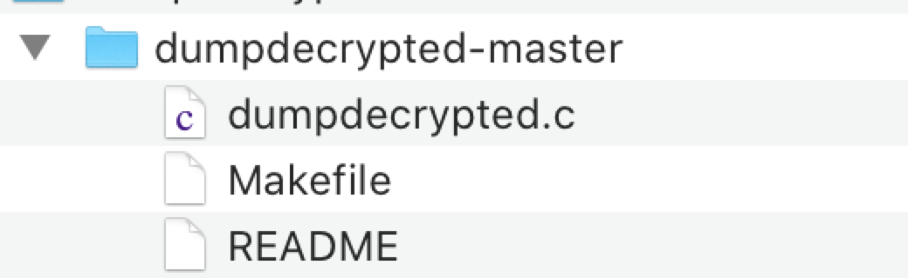
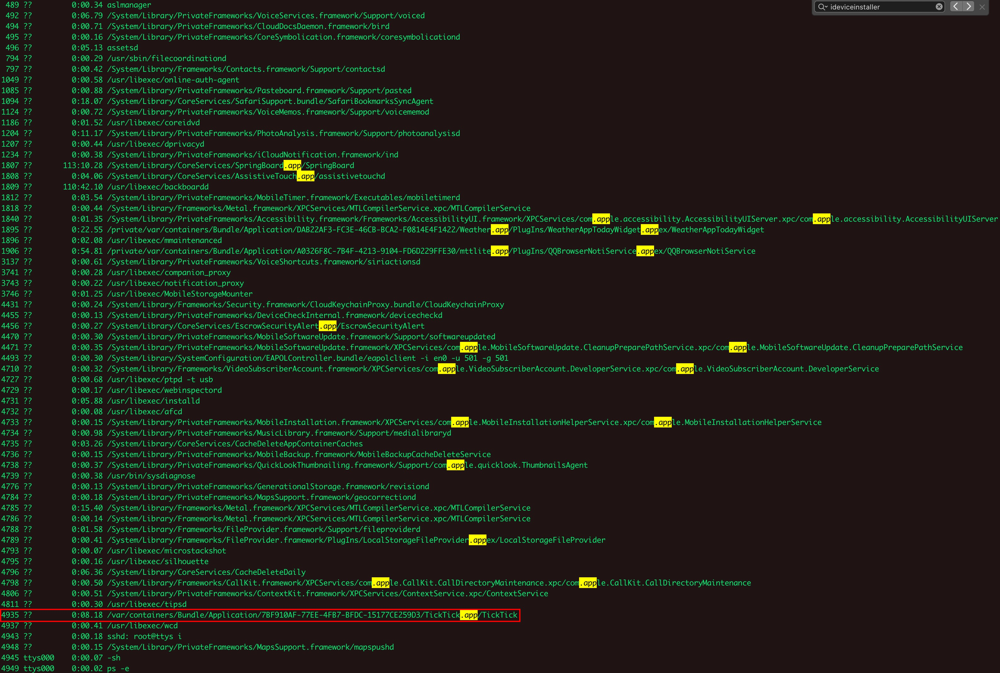
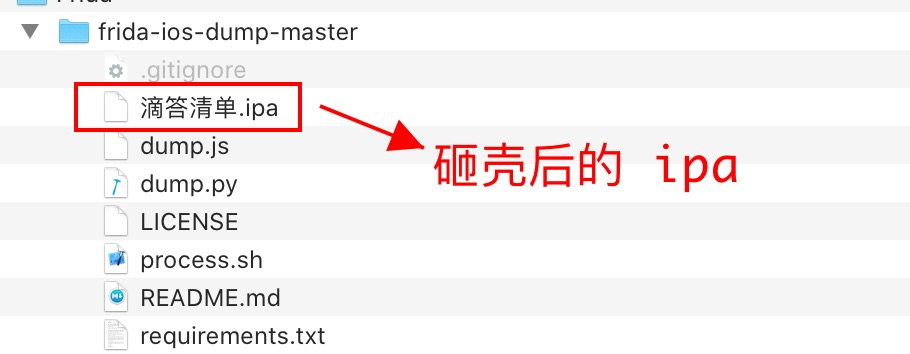
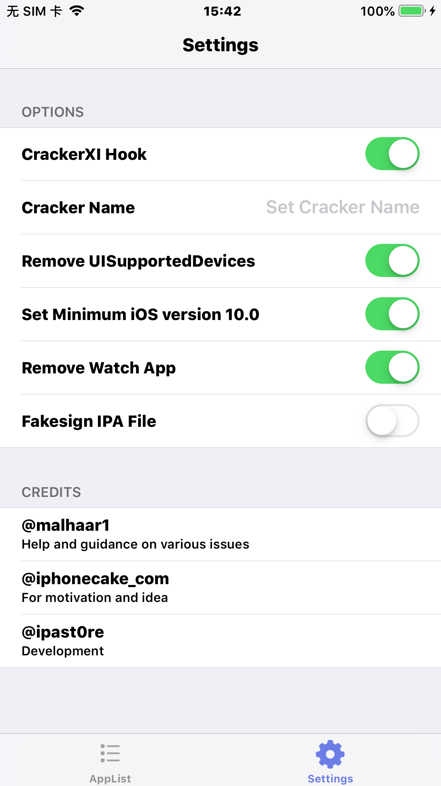
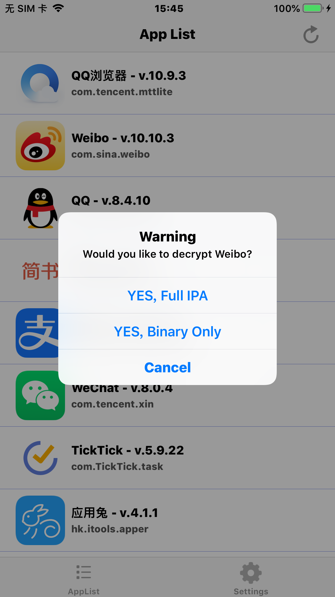
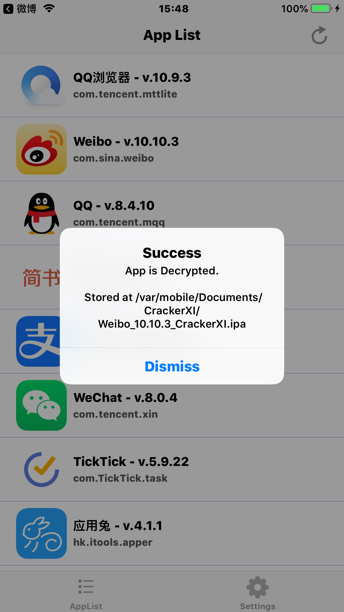

## iOS 越狱

1. Mac 上下载安装 Cydia Impactor，下载安装及使用，参考 [Cydia Impactor](https://cydia-app.com/cydia-impactor/)，安装该软件的目的是，将越狱需要使用的 ipa 直接安装到 iPhone 上。Cydia Impactor 使用时需要注意的点：
    
    一般 Apple 账号登录都会设置为双重验证登录，在使用 Cydia Impactor 往 iPhone 上安装 ipa 时，需要校验 AppleId，而校验 AppleId 时的密码，并不是 Apple 账号登录时的那个密码，而是 **双重认证的 App 专用密码**，具体如何获取 **双重认证的 App 专用密码**，可直接参考 [Cydia Impactor](https://cydia-app.com/cydia-impactor/) 中的 **Method 2: How to Install IPA Files with 2FA Enabled**
    
    
    
    
    
    
2. 下载 unc0ver 的 ipa 文件，并通过 Cydia Impactor 将 ipa 安装到需要越狱的 iPhone 上，下载地址为 [https://unc0ver.dev/](https://unc0ver.dev/)。安装完成后，在 iPhone 上打开 unc0ver，点击下方的 Jailbreak 按钮，开始越狱。使用 unc0ver 越狱需要注意的点：
    
    正常越狱成功应该要经历 30 个步骤，如果越狱过程中，到了第 2 步，就直接黑屏重启了，这绝对没有越狱成功，建议在 iPhone 重启之后，再多试几次，一定要在完整的走完 30 个步骤之后，iPhone 重启，才表示可能越狱成功了。如果重启几次，还是无法越狱成功，建议**将 unc0ver 卸载，再重新安装，再打开 unc0ver 进行越狱**。我也是重试过很多次才越狱成功。越狱成功后，再打开 unc0ver，看到的应该是这样的(下方的 Jailbreak 变为了 Re-Jailbreak)：
    
    
    

越狱成功后，就可以比较方便的使用 Mac 来控制 iPhone 了，下面介绍 Mac 与 iPhone 通信的一些工具。

### libimobiledevice

A library to communicate with services on iOS devices using native protocols.

#### 安装

可直接参考 libimobiledevice 的 [Github](https://github.com/libimobiledevice/libimobiledevice)，不过，Mac 上安装的话，建议 **直接使用 homebrew** 进行安装：

```shell
brew update
brew install libimobiledevice
# libimobiledevice中并不包含ipa的安装命令，所以还需要安装
brew install ideviceinstaller
```

#### 常用命令

1. 安装 ipa 包，卸载应用
    
    ```shell
    # 命令安装一个 ipa 文件到手机上，如果是企业签名的，非越狱机器也可以直接安装了。
    ideviceinstaller -I xxx.ipa
    
    # 命令卸载应用，需要知道此应用的 bundleID
    ideviceinstaller -U [bundleID]
    
    # 列出手机上安装的所有 app 的信息
    ideviceinstaller -u [UDID] -l 
    ```
2. 查看系统日志
    
    ```shell
    idevicesyslog
    ```
3. 查看当前已连接的设备的UUID
    
    ```shell
    idevice_id --list
    ```
4. 截图
    
    ```shell
    idevicescreenshot
    ```
5. 查看设备信息
    
    ```shell
    ideviceinfo
    ```
6. 获取设备时间
    
    ```shell
    idevicedate
    ```
7. 设置代理(可以用于转发端口，比如将 ssh 的端口映射到电脑，这样没有网络也可以 ssh 登录)
    
    ```shell
    iproxy
    ```
8. 挂载 DeveloperDiskImage，用于调试
    
    ```shell
    ideviceimagemounter
    ```
9. 获取设备名称
    
    ```shell
    idevicename
    ```
10. 调试程序（需要预先挂载 DeveloperImage）
    
    ```shell
    idevicedebug
    ```
11. 查看和操作设备的描述文件
    
    ```shell
    ideviceprovision list
    ```
    
### 挂载文件系统工具：ifuse

ifuse 是一个依赖 libimobiledevice 库的工具，所以必须首先安装 libimobiledevice

#### 安装

可以去 [https://osxfuse.github.io/](https://osxfuse.github.io/) 下载对应的库，然后按照要求进行编译，但是，在 Mac 上，建议 **直接使用 homebrew** 进行安装：

```shell
brew install osxfuse
brew install ifuse
```

#### 使用

1. 挂载媒体文件目录

    ```shell
    # 注意，此处的挂载点必须要真实存在，需要预先创建好目录，否则挂载失败
    ifuse [挂载点]
    ```

2. 挂载某应用的documents目录
    
    ```shell
    ifuse --documents [要挂载的应用的 bundleID] [挂载点]
    
    # 注意，iOS 8.3之后要求应用的 UIFileSharingEnabled 权限要开启，否则可能没有权限访问，会有如下的错误提示 
    
    ERROR: InstallationLookupFailed 
    The App 'com.wsgh.test' is either not present on the device, or the 'UIFileSharingEnabled' key is not set in its Info.plist. Starting with iOS 8.3 this key is mandatory to allow access to an app's Documents folder.
    ```

3. 挂载某应用的整个沙盒目录

    ```shell
    ifuse --container [要挂载的应用的bundleID] [挂载点]
    ```

4. 卸载挂载点
    
    ```shell
    fusermount -u [挂载点]
    ```

5. 如果是越狱的设备，并且配置好了，可以使用下面命令挂载整个 iPhone 文件系统
    
    ```shell
    ifuse --root [挂载点]
    ```

6. 详细说明，可以进入 ifuse 的 [Github 主页](https://github.com/libimobiledevice/ifuse) 查看原版文档

### OpenSSH

#### 安装

越狱成功后的 iPhone 会自动安装 Cydia 应用，打开 Cydia 应用，搜索 OpenSSH，安装即可。安装成功后，一般就可以正常使用 SSH 功能了。

#### 如何 SSH 到手机？

1. Mac 与 iPhone 连接同一局域网 Wifi，查看 iPhone 的 Wifi 对应的 ip 地址(比如，我测试用的手机，ip 地址为：192.168.0.145)，打开 Mac 的终端，输入：
    
    ```shell
    ssh root@192.168.0.145
    ```
    
    成功的话，终端会警告是否继续操作，输入 `yes` 即可，然后，终端会提示输入 root 密码。root 默认密码是 `alpine` (该密码可在 Cydia 的 OpenSSH 的介绍中查找到)。
    
2. 通过 USB 直接连接手机，这就需要借助 `usbmuxd` 工具了

#### usbmuxd

1. 安装

    ```shell
    brew install usbmuxd
    ```

2. 使用 `usbmuxd` 自带工具 `iproxy`，`iproxy` 可以快捷的操作连接 iPhone 等操作，MacOS 上只支持 4 位的端口号，需要把 iPhone 的默认端口 22 映射到 Mac 上面一个 4 位端口号的端口上面，相当于建立一个 Mac 和 iPhone 之间的通道

    ```shell
    iproxy 2222 22
    waiting for connection
    ```
    
    以上命令就是把当前连接设备的 22 端口(SSH端口)映射到电脑的 2222 端口，那么想和设备 22 端口通信，直接和本地的 2222 端口通信就可以了：
    
    ```shell
    ssh -p 2222 root@127.0.0.1
    ```
    
## ipa 砸壳

ipa 砸壳工具：

- Clutch
- dumpdecrypted
- frida-ios-dump
- CrackerXI

### Clutch

没有尝试使用 Clutch 进行砸壳，若要使用 Clutch，请参考这篇文章：[iOS 逆向: 砸壳](http://www.veryitman.com/2018/05/13/iOS-%E9%80%86%E5%90%91-%E7%A0%B8%E5%A3%B3/)

### dumpdecrypted

#### 编译 dumpdecrypted

首先到 [Github](https://github.com/stefanesser/dumpdecrypted) 下载 `dumpdecrypted` 源码，源码就一个 c 源文件，如下图：



cd 到对应的目录，执行 `make` 即可完成编译。编译成功后生成 `dumpdecrypted.dylib` 文件。

#### 对 dumpdecrypted.dylib 签名

> 如果不对该文件进行签名，后续砸壳操作会失败。当然，我使用的越狱手机，iOS 版本是 12.4.8，即使对该文件进行了签名，后续砸壳依然失败了 …… 推测是由于 iOS 版本较高，dumpdecrypted 对高版本的 iOS 兼容不够。

1. 找到已经在 Mac 上安装的苹果开发者证书，如下：
    
    ```shell
    # 列出可签名证书, 找到 mac 上面已经安装的证书
    security find-identity -v -p codesigning
    ```

2. 为 dumpdecrypted.dylib 签名，命令如下：
    
    ```shell
    codesign --force --verify --verbose --sign "iPhone Developer: xxx xxxx (xxxxxxxxxx)" dumpdecrypted.dylib
    ```
    其中，"iPhone Developer: xxx xxxx (xxxxxxxxxx)" 为自己本机安装的开发者证书名称。

#### SSH 连接手机

直接参考上面的章节 [OpenSSH](#OpenSSH)

#### 查找目标 APP 所在进程

- 手动杀掉 iPhone 上的所有进程
- 打开目标 APP，这里成为 TargetApp，本文以 "滴答清单" 作为 TargetApp
- 查看当前运行的所有进程
    
    ```shell
    ps -e
    ```
    
    结果如下图：
    
    
    
    注意上图红框中的部分：
    
    ```shell
    4935 ??         0:08.18 /var/containers/Bundle/Application/7BF910AF-77EE-4FB7-BFDC-15177CE259D3/TickTick.app/TickTick
    ```
    
    `TickTick.app` 就是我们需要的 TargetApp，4935 是该进程的进程号(记住该进程号，后续砸壳需要用到)，然后，可以使用 ls 查看 "/var/containers/Bundle/Application/7BF910AF-77EE-4FB7-BFDC-15177CE259D3/"(记住该目录，后续砸壳需要用到) 该目录下有什么内容：
    
    ```shell
    ceshishouji8:~ root# ls /var/containers/Bundle/Application/7BF910AF-77EE-4FB7-BFDC-15177CE259D3/
BundleMetadata.plist  TickTick.app/  iTunesMetadata.plist
    ```
    
    由此可知，我们的 TargetApp 就在 iPhone 的 "/var/containers/Bundle/Application/7BF910AF-77EE-4FB7-BFDC-15177CE259D3/" 目录下。
    
#### 砸壳

1. 查找 Documents 目录
    
    通过上一节，我们可以知道，`TickTick` 为当前的进程目标执行文件名称，其对应的进程 id 是 `4935`，在终端中通过 cycript 执行如下操作：
    
    ```shell
    cycript -p 4935
    ```
    
    再执行 OC 方法，如下：
    
    ```objc
    [[NSFileManager defaultManager] URLsForDirectory:NSDocumentDirectory inDomains:NSUserDomainMask][0]
    ```
    
    可以看到对应的输出，如下所示，这就是对应的 Documents 目录：
    
    ```shell
    #"file:///var/mobile/Containers/Data/Application/0FF90CE8-DFB3-438E-810A-21C4B752A2A1/Documents/"
    ```
    
    > 注意： 执行过程中, 在 iPhone 上面打开运行一下 App, 不然上面的执行一直卡在那里不动。
    
    > 注意：cycript 为 iPhone 上的工具，是在 ssh 连接 iPhone 成功后才能执行的，该工具可以 **直接通过 iPhone 的 Cydia 应用进行下载**。

2. 拷贝 dumpdecrypted.dylib，Mac 上另外打开一个终端窗口，通过 `scp` 将 dumpdecrypted.dylib 拷贝到 iPhone 中 TargetApp 的 Documents 目录下：

    ```shell
    scp /Users/noctis/Documents/LiuLian/DumpDecrypted/dumpdecrypted-master/dumpdecrypted.dylib  root@192.168.0.145:/var/mobile/Containers/Data/Application/0FF90CE8-DFB3-438E-810A-21C4B752A2A1/Documents
    ```

    > 注意：这里 root@ 后面跟着的 ip 是 iPhone 所连 Wifi 的 ip，当然，iPhone 必须跟 Mac 连接同一局域网的同一个 Wifi。后续若砸壳成功，在将砸壳后的 ipa 拷贝到 Mac 上时，也是要新开终端窗口，通过 `scp` 命令进行拷贝。这里需要注意的是，执行 `scp` 命令时，**一定是在 Mac 的环境下，而不能在 iPhone 的环境下执行**。
    
    ```shell
    scp root@192.168.0.145:/var/mobile/Documents/CrackerXI/TickTick_5.9.22_CrackerXI.ipa /Users/noctis/Downloads
    ```
    
3. 退出 cycript

    ```shell
    ctrl + d
    ```
    
4. cd 到 Documents 目录

    ```shell
    cd /var/mobile/Containers/Data/Application/0FF90CE8-DFB3-438E-810A-21C4B752A2A1/Documents/
    ```
    
5. 砸壳

    ```shell
    DYLD_INSERT_LIBRARIES=dumpdecrypted.dylib /var/containers/Bundle/Application/7BF910AF-77EE-4FB7-BFDC-15177CE259D3/TickTick.app/TickTick
    ```
    
6. Killed: 9

    ```shell
    ceshishouji8:/var/mobile/Containers/Data/Application/0FF90CE8-DFB3-438E-810A-21C4B752A2A1/Documents root# DYLD_INSERT_LIBRARIES=dumpdecrypted.dylib /var/containers/Bundle/Application/7BF910AF-77EE-4FB7-BFDC-15177CE259D3/TickTick.app/TickTick
Killed: 9
    ```
    
    本以为能够顺利完成砸壳，没想到还是失败在了黎明的前夜。在网上查了 `Killed: 9` 的具体原因，一般都说是由于 dumpdecrypted.dylib 文件未签名所致，但是，实际上，我已经对 dumpdecrypted.dylib 签名过了，处于谨慎考虑，我又重新对 dumpdecrypted.dylib 进行签名，然后重复上面的步骤，反反复复试过几次，并使用不同的证书对 dumpdecrypted.dylib 进行签名，最终得到的结果都是 `Killed: 9`。我推测是由于 iOS 版本较高，dumpdecrypted 对高版本的 iOS 兼容不够导致使用 `dumpdecrypted` 无法砸壳成功。当然，也有可能是我知识水平不够，在某些步骤上执行有误所致。
    
#### dumpdecrypted 总结

至此， 通过 `dumpdecrypted` 砸壳以失败告终。但是，在这个过程中，我学到了 `libimobiledevice`、`OpenSSH`、`cycript`，这就够了。

### frida-ios-dump

通过 `frida-ios-dump` 进行砸壳的流程，比通过 `dumpdecrypted` 砸壳的流程相对来说要简单一些。

#### 下载编译 frida-ios-dump

首先到 [Github](https://github.com/AloneMonkey/frida-ios-dump) 上下载 frida-ios-dump，下载解压缩之后，cd 到对应的目录，然后执行如下命令：

```shell
sudo pip3 install -r requirements.txt --upgrade
```

#### ssh 连接手机

直接参考上面的章节。

#### 砸壳

1. 使用 `ideviceinfo` 找到 iPhone 的 UDID

    ```shell
    LiuLiandeiMac:frida-ios-dump-master noctis$ ideviceinfo
    ActivationState: Activated
    ActivationStateAcknowledged: true
    BasebandActivationTicketVersion: V2
    BasebandCertId: 3840149528
    BasebandChipID: 8343777
    BasebandKeyHashInformation:
     AKeyStatus: 2
     SKeyHash: u+/tcCwvaQ+1Y9t40I4yegCEmB28mALlaROhaIVGBWo=
     SKeyStatus: 0
    BasebandMasterKeyHash: 8CB15EE4C8002199070D9500BB8FB183B02713A5CA2A6B92DB5E75CE15536182
    BasebandRegionSKU: BQAAAAQAAAAAAAAAAAAAAAAAAAAAAAAAAAAAAAAAAAAAAAAAAAAAAAAAAAAAAAAAAAAAAAAAAAAAAAAAAAAAAA==
    BasebandSerialNumber: BpdFZw==
    BasebandStatus: BBInfoAvailable
    BasebandVersion: 7.80.04
    BluetoothAddress: 60:f8:1d:56:d8:da
    BoardId: 4
    BrickState: false
    BuildVersion: 16G201
    CPUArchitecture: arm64
    CarrierBundleInfoArray[0]:
    CertID: 3840149528
    ChipID: 28672
    ChipSerialNo: BpdFZw==
    DeviceClass: iPhone
    DeviceColor: #3b3b3c
    DeviceName: 测试手机12.4.8
    DieID: 339603469469734
    EthernetAddress: 60:f8:1d:56:d8:db
    FirmwareVersion: iBoot-4513.270.14
    FusingStatus: 3
    HardwareModel: N56AP
    HardwarePlatform: t7000
    HasSiDP: true
    HostAttached: true
    InternationalMobileEquipmentIdentity: 354437062465055
    MLBSerialNumber: F3Y44433KVRFKV8C
    MobileEquipmentIdentifier: 35443706246505
    MobileSubscriberCountryCode:
    MobileSubscriberNetworkCode:
    ModelNumber: MGA82
    NonVolatileRAM:
     IONVRAM-SYNCNOW-PROPERTY: SU9OVlJBTS1TWU5DTk9XLVBST1BFUlRZ
     auto-boot: dHJ1ZQ==
     backlight-level: MTU1NQ==
     boot-args:
     com.apple.System.tz0-size: MHhDMDAwMDA=
     oblit-begins: T2JsaXRUeXBlOiBPYmxpdGVyYXRlRGF0YVBhcnRpdGlvbi4gUmVhc29uOiB1bmtub3du
     obliteration: aGFuZGxlX21lc3NhZ2U6IE9ibGl0ZXJhdGlvbiBDb21wbGV0ZQ==
    PartitionType: GUID_partition_scheme
    PasswordProtected: false
    PkHash: 5OQIGNymupBn16zMKPujMp3562XDnNFkULy+gshbERM=
    ProductName: iPhone OS
    ProductType: iPhone7,1
    ProductVersion: 12.4.8
    ProductionSOC: true
    ProtocolVersion: 2
    ProximitySensorCalibration: T00EAA0KQzgQA7wCsATfALwCVgADAKoFTQMCAEn69wLuAksAhgC8AagtBRoAAAAA4QCVAAECAAArAAAAAAAAAAAAAAAAAAAAAAAAAAAAAAAAAAAAAAAAAAAAAAAAAAAAAAAAAAAAAAAAAAAAAAAAAAAAAAAAAAAAAAAAAAAAAAA=
    RegionInfo: CH/A
    SBLockdownEverRegisteredKey: true
    SIMStatus: kCTSIMSupportSIMStatusNotInserted
    SIMTrayStatus: kCTSIMSupportSIMTrayInsertedNoSIM
    SerialNumber: FK3NMRC3G5QQ
    SoftwareBehavior: QQEAAAAAAAAAAAAAAAAAAA==
    SoftwareBundleVersion:
    SupportedDeviceFamilies[1]:
     0: 1
    TelephonyCapability: true
    TimeIntervalSince1970: 1619323664.422883
    TimeZone: Asia/Shanghai
    TimeZoneOffsetFromUTC: 28800.000000
    TrustedHostAttached: true
    UniqueChipID: 339603469469734
    UniqueDeviceID: 4e88aedb2177d209fe820858437398c78f21d8c3
    UseRaptorCerts: true
    Uses24HourClock: true
    WiFiAddress: 60:f8:1d:56:d8:d9
    WirelessBoardSerialNumber: 4441A1611957
    kCTPostponementInfoPRLName: 0
    kCTPostponementInfoServiceProvisioningState: false
    kCTPostponementStatus: kCTPostponementStatusActivated
    ```
    
    其中 `UniqueDeviceID` 的值就是 UDID。 
    
2. 使用 `ideviceinstaller` 获取 iPhone 的应用列表

    ```shell
        LiuLiandeiMac:frida-ios-dump-master noctis$ ideviceinstaller -u 4e88aedb2177d209fe820858437398c78f21d8c3 -l
    CFBundleIdentifier, CFBundleVersion, CFBundleDisplayName
    com.geetest.g1.gt3-test, "1", "GT3DevTest"
    com.geetest.gateauth, "2.3.8-2103161013", "无感本机认证"
    com.tencent.mttlite, "10.9.3.4568", "QQ浏览器"
    com.sina.weibo, "48504", "微博"
    com.tencent.mqq, "8.4.10.666", "QQ"
    com.jianshu.Hugo, "2103111736", "简书"
    com.alipay.iphoneclient, "10.2.18.6010", "支付宝"
    com.geetest.HelloGTCapcha4, "1", "HelloGTCaptcha4"
    com.geetest.pri.g1.gt3-test, "1", "行为验证私有化标准版本"
    com.tencent.xin, "8.0.4.34", "微信"
    com.geetest.pri.HelloGeeGuard, "1", "HelloGeeGuard"
    com.geetest.g1.gt3-fusion-test, "2104191515", "验证融合"
    com.TickTick.task, "1.2", "滴答清单"
    hk.itools.apper, "4.1.1.3", "应用兔"
    science.xnu.undecimus, "1", "unc0ver"
    com.geetest.GeeLoggerExample, "3", "GeeLoggerExample"
    com.geetest.glancedemo, "1.2.0-2101261817", "先鉴"
    com.geetest.pri.g1.gt3-test.shein, "1", "行为验证私有化-SHEIN"
    ```
    
3. 打开 Mac 终端，cd 到 frida-ios-dump-master 目录，然后执行 dump.py 砸壳
    
    ```shell
    python3 dump.py com.TickTick.task
    ```
    
    > 注意：dump.py 后面的参数是需要砸壳的 app 对应的 bundleId，上面我们通过 `ideviceinstaller` 已经可以拿到所有 app 的 bundleId 了。

4. 解决 "need Gadget to attach on jailed iOS; its default location is: /Users/noctis/.cache/frida/gadget-ios.dylib" 错误

    ```shell
    LiuLiandeiMac:frida-ios-dump-master noctis$ python3 dump.py com.TickTick.task
    Start the target app com.TickTick.task
    need Gadget to attach on jailed iOS; its default location is: /Users/noctis/.cache/frida/gadget-ios.dylib
    ```
    
    > 若执行 dump.py 之后报错 "need Gadget to attach on jailed iOS; its default location is: /Users/noctis/.cache/frida/gadget-ios.dylib"，可先到 [frida-gadget](https://github.com/frida/frida/releases/download/14.2.2/frida-gadget-14.2.2-ios-universal.dylib.gz) 上下载 frida-gadget 文件，下载下来的文件为 frida-gadget-14.2.2-ios-universal.dylib.gz，解压之后为 frida-gadget-14.2.2-ios-universal.dylib，根据报错提示，将 frida-gadget-14.2.2-ios-universal.dylib 文件名改为 gadget-ios.dylib，然后 cd 到 /Users/noctis 目录，在该目录新建 .cache 目录，再 cd 到 .cache 目录，新建 frida 目录，最后将 gadget-ios.dylib 拷贝到 frida 目录。再次重新执行 dump.py：
    
    ```shell
    LiuLiandeiMac:frida-ios-dump-master noctis$ python3 dump.py com.TickTick.task
    Start the target app com.TickTick.task
    Dumping 滴答清单 to /var/folders/f3/fgqswwbn1nzbrmvtcs6pjj2c0000gp/T
    [frida-ios-dump]: Load SwiftyJSON.framework success.
    [frida-ios-dump]: Load GRDB.framework success.
    [frida-ios-dump]: Load SVProgressHUD.framework success.
    [frida-ios-dump]: FirebaseCore.framework has been loaded.
    [frida-ios-dump]: Load SwiftyBeaver.framework success.
    [frida-ios-dump]: Load YYText.framework success.
    [frida-ios-dump]: Load GoogleToolboxForMac.framework success.
    [frida-ios-dump]: Load FBLPromises.framework success.
    [frida-ios-dump]: Load FirebaseInstallations.framework success.
    [frida-ios-dump]: Load CalculateRecurrence.framework success.
    [frida-ios-dump]: Load AFNetworking.framework success.
    [frida-ios-dump]: Load nlp_iOS.framework success.
    [frida-ios-dump]: Load FirebaseCoreDiagnostics.framework success.
    [frida-ios-dump]: IQKeyboardManager.framework has been loaded.
    [frida-ios-dump]: Load FBSDKShareKit.framework success.
    [frida-ios-dump]: Load Matrix.framework success.
    [frida-ios-dump]: FirebasePerformance.framework has been loaded.
    [frida-ios-dump]: Load SnapKit.framework success.
    [frida-ios-dump]: Load SwiftGifOrigin.framework success.
    [frida-ios-dump]: Load Highlightr.framework success.
    [frida-ios-dump]: Load GoogleUtilities.framework success.
    [frida-ios-dump]: Load TickTickKit.framework success.
    [frida-ios-dump]: Load TickTickSiriKit.framework success.
    [frida-ios-dump]: Load FBSDKLoginKit.framework success.
    [frida-ios-dump]: Load HanziPinyin.framework success.
    [frida-ios-dump]: Load GRDBObjc.framework success.
    [frida-ios-dump]: Load nanopb.framework success.
    [frida-ios-dump]: Load SSZipArchive.framework success.
    [frida-ios-dump]: Load FirebaseABTesting.framework success.
    [frida-ios-dump]: Load dsBridge.framework success.
    [frida-ios-dump]: Load FBSDKCoreKit.framework success.
    [frida-ios-dump]: Load GoogleDataTransport.framework success.
    [frida-ios-dump]: Load SDWebImage.framework success.
    [frida-ios-dump]: Load GTMSessionFetcher.framework success.
    [frida-ios-dump]: Load MMWormhole.framework success.
    [frida-ios-dump]: Load Lottie.framework success.
    [frida-ios-dump]: Load AppestKit.framework success.
    [frida-ios-dump]: Load Protobuf.framework success.
    [frida-ios-dump]: Load FirebaseCrashlytics.framework success.
    [frida-ios-dump]: Load GRDBObjcCore.framework success.
    [frida-ios-dump]: Load TickTickIntentsExtensionHandlerForiOS.framework success.
    [frida-ios-dump]: Load PureLayout.framework success.
    [frida-ios-dump]: Load FirebaseRemoteConfig.framework success.
    start dump /var/containers/Bundle/Application/7BF910AF-77EE-4FB7-BFDC-15177CE259D3/TickTick.app/TickTick
    TickTick.fid: 100%|███████████████████████████████████████████████████████████████████████████████████████████████████████████████████████████████████████████████████████████████████████████| 19.4M/19.4M [00:00<00:00, 23.7MB/s]
    start dump /private/var/containers/Bundle/Application/7BF910AF-77EE-4FB7-BFDC-15177CE259D3/TickTick.app/Frameworks/AFNetworking.framework/AFNetworking
    AFNetworking.fid: 100%|█████████████████████████████████████████████████████████████████████████████████████████████████████████████████████████████████████████████████████████████████████████| 532k/532k [00:00<00:00, 5.72MB/s]
    start dump /private/var/containers/Bundle/Application/7BF910AF-77EE-4FB7-BFDC-15177CE259D3/TickTick.app/Frameworks/AppestKit.framework/AppestKit
    AppestKit.fid: 100%|██████████████████████████████████████████████████████████████████████████████████████████████████████████████████████████████████████████████████████████████████████████| 3.71M/3.71M [00:00<00:00, 21.7MB/s]
    start dump /private/var/containers/Bundle/Application/7BF910AF-77EE-4FB7-BFDC-15177CE259D3/TickTick.app/Frameworks/CalculateRecurrence.framework/CalculateRecurrence
    CalculateRecurrence.fid: 100%|████████████████████████████████████████████████████████████████████████████████████████████████████████████████████████████████████████████████████████████████| 2.72M/2.72M [00:00<00:00, 17.9MB/s]
    start dump /private/var/containers/Bundle/Application/7BF910AF-77EE-4FB7-BFDC-15177CE259D3/TickTick.app/Frameworks/FBLPromises.framework/FBLPromises
    FBLPromises.fid: 100%|██████████████████████████████████████████████████████████████████████████████████████████████████████████████████████████████████████████████████████████████████████████| 187k/187k [00:00<00:00, 2.24MB/s]
    start dump /private/var/containers/Bundle/Application/7BF910AF-77EE-4FB7-BFDC-15177CE259D3/TickTick.app/Frameworks/FBSDKCoreKit.framework/FBSDKCoreKit
    FBSDKCoreKit.fid: 100%|███████████████████████████████████████████████████████████████████████████████████████████████████████████████████████████████████████████████████████████████████████| 1.71M/1.71M [00:00<00:00, 13.3MB/s]
    start dump /private/var/containers/Bundle/Application/7BF910AF-77EE-4FB7-BFDC-15177CE259D3/TickTick.app/Frameworks/FBSDKLoginKit.framework/FBSDKLoginKit
    FBSDKLoginKit.fid: 100%|████████████████████████████████████████████████████████████████████████████████████████████████████████████████████████████████████████████████████████████████████████| 372k/372k [00:00<00:00, 3.98MB/s]
    start dump /private/var/containers/Bundle/Application/7BF910AF-77EE-4FB7-BFDC-15177CE259D3/TickTick.app/Frameworks/FBSDKShareKit.framework/FBSDKShareKit
    FBSDKShareKit.fid: 100%|████████████████████████████████████████████████████████████████████████████████████████████████████████████████████████████████████████████████████████████████████████| 521k/521k [00:00<00:00, 5.41MB/s]
    start dump /private/var/containers/Bundle/Application/7BF910AF-77EE-4FB7-BFDC-15177CE259D3/TickTick.app/Frameworks/FirebaseABTesting.framework/FirebaseABTesting
    FirebaseABTesting.fid: 100%|████████████████████████████████████████████████████████████████████████████████████████████████████████████████████████████████████████████████████████████████████| 117k/117k [00:00<00:00, 1.20MB/s]
    start dump /private/var/containers/Bundle/Application/7BF910AF-77EE-4FB7-BFDC-15177CE259D3/TickTick.app/Frameworks/FirebaseCore.framework/FirebaseCore
    FirebaseCore.fid: 100%|█████████████████████████████████████████████████████████████████████████████████████████████████████████████████████████████████████████████████████████████████████████| 191k/191k [00:00<00:00, 2.30MB/s]
    start dump /private/var/containers/Bundle/Application/7BF910AF-77EE-4FB7-BFDC-15177CE259D3/TickTick.app/Frameworks/FirebaseCoreDiagnostics.framework/FirebaseCoreDiagnostics
    FirebaseCoreDiagnostics.fid: 100%|████████████████████████████████████████████████████████████████████████████████████████████████████████████████████████████████████████████████████████████| 83.3k/83.3k [00:00<00:00, 1.01MB/s]
    start dump /private/var/containers/Bundle/Application/7BF910AF-77EE-4FB7-BFDC-15177CE259D3/TickTick.app/Frameworks/FirebaseCrashlytics.framework/FirebaseCrashlytics
    FirebaseCrashlytics.fid: 100%|██████████████████████████████████████████████████████████████████████████████████████████████████████████████████████████████████████████████████████████████████| 662k/662k [00:00<00:00, 6.70MB/s]
    start dump /private/var/containers/Bundle/Application/7BF910AF-77EE-4FB7-BFDC-15177CE259D3/TickTick.app/Frameworks/FirebaseInstallations.framework/FirebaseInstallations
    FirebaseInstallations.fid: 100%|████████████████████████████████████████████████████████████████████████████████████████████████████████████████████████████████████████████████████████████████| 277k/277k [00:00<00:00, 3.18MB/s]
    start dump /private/var/containers/Bundle/Application/7BF910AF-77EE-4FB7-BFDC-15177CE259D3/TickTick.app/Frameworks/FirebasePerformance.framework/FirebasePerformance
    FirebasePerformance.fid: 100%|██████████████████████████████████████████████████████████████████████████████████████████████████████████████████████████████████████████████████████████████████| 585k/585k [00:00<00:00, 5.48MB/s]
    start dump /private/var/containers/Bundle/Application/7BF910AF-77EE-4FB7-BFDC-15177CE259D3/TickTick.app/Frameworks/FirebaseRemoteConfig.framework/FirebaseRemoteConfig
    FirebaseRemoteConfig.fid: 100%|█████████████████████████████████████████████████████████████████████████████████████████████████████████████████████████████████████████████████████████████████| 312k/312k [00:00<00:00, 3.57MB/s]
    start dump /private/var/containers/Bundle/Application/7BF910AF-77EE-4FB7-BFDC-15177CE259D3/TickTick.app/Frameworks/GRDB.framework/GRDB
    GRDB.fid: 100%|███████████████████████████████████████████████████████████████████████████████████████████████████████████████████████████████████████████████████████████████████████████████| 4.90M/4.90M [00:00<00:00, 20.3MB/s]
    start dump /private/var/containers/Bundle/Application/7BF910AF-77EE-4FB7-BFDC-15177CE259D3/TickTick.app/Frameworks/GRDBObjc.framework/GRDBObjc
    GRDBObjc.fid: 100%|████████████████████████████████████████████████████████████████████████████████████████████████████████████████████████████████████████████████████████████████████████████| 73.4k/73.4k [00:00<00:00, 958kB/s]
    start dump /private/var/containers/Bundle/Application/7BF910AF-77EE-4FB7-BFDC-15177CE259D3/TickTick.app/Frameworks/GRDBObjcCore.framework/GRDBObjcCore
    GRDBObjcCore.fid: 100%|█████████████████████████████████████████████████████████████████████████████████████████████████████████████████████████████████████████████████████████████████████████| 314k/314k [00:00<00:00, 3.85MB/s]
    start dump /private/var/containers/Bundle/Application/7BF910AF-77EE-4FB7-BFDC-15177CE259D3/TickTick.app/Frameworks/GTMSessionFetcher.framework/GTMSessionFetcher
    GTMSessionFetcher.fid: 100%|████████████████████████████████████████████████████████████████████████████████████████████████████████████████████████████████████████████████████████████████████| 409k/409k [00:00<00:00, 4.82MB/s]
    start dump /private/var/containers/Bundle/Application/7BF910AF-77EE-4FB7-BFDC-15177CE259D3/TickTick.app/Frameworks/GoogleDataTransport.framework/GoogleDataTransport
    GoogleDataTransport.fid: 100%|██████████████████████████████████████████████████████████████████████████████████████████████████████████████████████████████████████████████████████████████████| 347k/347k [00:00<00:00, 4.04MB/s]
    start dump /private/var/containers/Bundle/Application/7BF910AF-77EE-4FB7-BFDC-15177CE259D3/TickTick.app/Frameworks/GoogleToolboxForMac.framework/GoogleToolboxForMac
    GoogleToolboxForMac.fid: 100%|█████████████████████████████████████████████████████████████████████████████████████████████████████████████████████████████████████████████████████████████████| 74.2k/74.2k [00:00<00:00, 997kB/s]
    start dump /private/var/containers/Bundle/Application/7BF910AF-77EE-4FB7-BFDC-15177CE259D3/TickTick.app/Frameworks/GoogleUtilities.framework/GoogleUtilities
    GoogleUtilities.fid: 100%|██████████████████████████████████████████████████████████████████████████████████████████████████████████████████████████████████████████████████████████████████████| 301k/301k [00:00<00:00, 3.74MB/s]
    start dump /private/var/containers/Bundle/Application/7BF910AF-77EE-4FB7-BFDC-15177CE259D3/TickTick.app/Frameworks/HanziPinyin.framework/HanziPinyin
    HanziPinyin.fid: 100%|██████████████████████████████████████████████████████████████████████████████████████████████████████████████████████████████████████████████████████████████████████████| 144k/144k [00:00<00:00, 1.87MB/s]
    start dump /private/var/containers/Bundle/Application/7BF910AF-77EE-4FB7-BFDC-15177CE259D3/TickTick.app/Frameworks/Highlightr.framework/Highlightr
    Highlightr.fid: 100%|███████████████████████████████████████████████████████████████████████████████████████████████████████████████████████████████████████████████████████████████████████████| 307k/307k [00:00<00:00, 3.83MB/s]
    start dump /private/var/containers/Bundle/Application/7BF910AF-77EE-4FB7-BFDC-15177CE259D3/TickTick.app/Frameworks/IQKeyboardManager.framework/IQKeyboardManager
    IQKeyboardManager.fid: 100%|████████████████████████████████████████████████████████████████████████████████████████████████████████████████████████████████████████████████████████████████████| 303k/303k [00:00<00:00, 3.75MB/s]
    start dump /private/var/containers/Bundle/Application/7BF910AF-77EE-4FB7-BFDC-15177CE259D3/TickTick.app/Frameworks/Lottie.framework/Lottie
    Lottie.fid: 100%|███████████████████████████████████████████████████████████████████████████████████████████████████████████████████████████████████████████████████████████████████████████████| 573k/573k [00:00<00:00, 6.52MB/s]
    start dump /private/var/containers/Bundle/Application/7BF910AF-77EE-4FB7-BFDC-15177CE259D3/TickTick.app/Frameworks/MMWormhole.framework/MMWormhole
    MMWormhole.fid: 100%|███████████████████████████████████████████████████████████████████████████████████████████████████████████████████████████████████████████████████████████████████████████| 123k/123k [00:00<00:00, 1.59MB/s]
    start dump /private/var/containers/Bundle/Application/7BF910AF-77EE-4FB7-BFDC-15177CE259D3/TickTick.app/Frameworks/Matrix.framework/Matrix
    Matrix.fid: 100%|█████████████████████████████████████████████████████████████████████████████████████████████████████████████████████████████████████████████████████████████████████████████| 1.23M/1.23M [00:00<00:00, 11.9MB/s]
    start dump /private/var/containers/Bundle/Application/7BF910AF-77EE-4FB7-BFDC-15177CE259D3/TickTick.app/Frameworks/Protobuf.framework/Protobuf
    Protobuf.fid: 100%|█████████████████████████████████████████████████████████████████████████████████████████████████████████████████████████████████████████████████████████████████████████████| 987k/987k [00:00<00:00, 9.90MB/s]
    start dump /private/var/containers/Bundle/Application/7BF910AF-77EE-4FB7-BFDC-15177CE259D3/TickTick.app/Frameworks/PureLayout.framework/PureLayout
    PureLayout.fid: 100%|███████████████████████████████████████████████████████████████████████████████████████████████████████████████████████████████████████████████████████████████████████████| 110k/110k [00:00<00:00, 1.47MB/s]
    start dump /private/var/containers/Bundle/Application/7BF910AF-77EE-4FB7-BFDC-15177CE259D3/TickTick.app/Frameworks/SDWebImage.framework/SDWebImage
    SDWebImage.fid: 100%|███████████████████████████████████████████████████████████████████████████████████████████████████████████████████████████████████████████████████████████████████████████| 809k/809k [00:00<00:00, 8.69MB/s]
    start dump /private/var/containers/Bundle/Application/7BF910AF-77EE-4FB7-BFDC-15177CE259D3/TickTick.app/Frameworks/SSZipArchive.framework/SSZipArchive
    SSZipArchive.fid: 100%|█████████████████████████████████████████████████████████████████████████████████████████████████████████████████████████████████████████████████████████████████████████| 218k/218k [00:00<00:00, 2.78MB/s]
    start dump /private/var/containers/Bundle/Application/7BF910AF-77EE-4FB7-BFDC-15177CE259D3/TickTick.app/Frameworks/SVProgressHUD.framework/SVProgressHUD
    SVProgressHUD.fid: 100%|████████████████████████████████████████████████████████████████████████████████████████████████████████████████████████████████████████████████████████████████████████| 179k/179k [00:00<00:00, 2.30MB/s]
    start dump /private/var/containers/Bundle/Application/7BF910AF-77EE-4FB7-BFDC-15177CE259D3/TickTick.app/Frameworks/SnapKit.framework/SnapKit
    SnapKit.fid: 100%|██████████████████████████████████████████████████████████████████████████████████████████████████████████████████████████████████████████████████████████████████████████████| 393k/393k [00:00<00:00, 4.72MB/s]
    start dump /private/var/containers/Bundle/Application/7BF910AF-77EE-4FB7-BFDC-15177CE259D3/TickTick.app/Frameworks/SwiftGifOrigin.framework/SwiftGifOrigin
    SwiftGifOrigin.fid: 100%|███████████████████████████████████████████████████████████████████████████████████████████████████████████████████████████████████████████████████████████████████████| 114k/114k [00:00<00:00, 1.48MB/s]
    start dump /private/var/containers/Bundle/Application/7BF910AF-77EE-4FB7-BFDC-15177CE259D3/TickTick.app/Frameworks/SwiftyBeaver.framework/SwiftyBeaver
    SwiftyBeaver.fid: 100%|█████████████████████████████████████████████████████████████████████████████████████████████████████████████████████████████████████████████████████████████████████████| 566k/566k [00:00<00:00, 5.74MB/s]
    start dump /private/var/containers/Bundle/Application/7BF910AF-77EE-4FB7-BFDC-15177CE259D3/TickTick.app/Frameworks/SwiftyJSON.framework/SwiftyJSON
    SwiftyJSON.fid: 100%|███████████████████████████████████████████████████████████████████████████████████████████████████████████████████████████████████████████████████████████████████████████| 338k/338k [00:00<00:00, 4.00MB/s]
    start dump /private/var/containers/Bundle/Application/7BF910AF-77EE-4FB7-BFDC-15177CE259D3/TickTick.app/Frameworks/YYText.framework/YYText
    YYText.fid: 100%|███████████████████████████████████████████████████████████████████████████████████████████████████████████████████████████████████████████████████████████████████████████████| 922k/922k [00:00<00:00, 9.25MB/s]
    start dump /private/var/containers/Bundle/Application/7BF910AF-77EE-4FB7-BFDC-15177CE259D3/TickTick.app/Frameworks/dsBridge.framework/dsBridge
    dsBridge.fid: 100%|█████████████████████████████████████████████████████████████████████████████████████████████████████████████████████████████████████████████████████████████████████████████| 108k/108k [00:00<00:00, 1.43MB/s]
    start dump /private/var/containers/Bundle/Application/7BF910AF-77EE-4FB7-BFDC-15177CE259D3/TickTick.app/Frameworks/nanopb.framework/nanopb
    nanopb.fid: 100%|█████████████████████████████████████████████████████████████████████████████████████████████████████████████████████████████████████████████████████████████████████████████| 79.9k/79.9k [00:00<00:00, 1.04MB/s]
    start dump /private/var/containers/Bundle/Application/7BF910AF-77EE-4FB7-BFDC-15177CE259D3/TickTick.app/Frameworks/TickTickKit.framework/TickTickKit
    TickTickKit.fid: 100%|████████████████████████████████████████████████████████████████████████████████████████████████████████████████████████████████████████████████████████████████████████| 5.56M/5.56M [00:00<00:00, 26.1MB/s]
    start dump /private/var/containers/Bundle/Application/7BF910AF-77EE-4FB7-BFDC-15177CE259D3/TickTick.app/Frameworks/TickTickSiriKit.framework/TickTickSiriKit
    TickTickSiriKit.fid: 100%|██████████████████████████████████████████████████████████████████████████████████████████████████████████████████████████████████████████████████████████████████████| 196k/196k [00:00<00:00, 2.52MB/s]
    start dump /private/var/containers/Bundle/Application/7BF910AF-77EE-4FB7-BFDC-15177CE259D3/TickTick.app/Frameworks/TickTickIntentsExtensionHandlerForiOS.framework/TickTickIntentsExtensionHandlerForiOS
    TickTickIntentsExtensionHandlerForiOS.fid: 100%|████████████████████████████████████████████████████████████████████████████████████████████████████████████████████████████████████████████████| 223k/223k [00:00<00:00, 2.85MB/s]
    start dump /private/var/containers/Bundle/Application/7BF910AF-77EE-4FB7-BFDC-15177CE259D3/TickTick.app/Frameworks/nlp_iOS.framework/nlp_iOS
    nlp_iOS.fid: 100%|██████████████████████████████████████████████████████████████████████████████████████████████████████████████████████████████████████████████████████████████████████████████| 844k/844k [00:00<00:00, 8.90MB/s]
    TickTick: 218MB [00:23, 9.88MB/s]
    0.00B [00:00, ?B/s]Generating "滴答清单.ipa"
    ```
    
    这样就砸壳成功了，可以到 frida-ios-dump-master 目录下看到砸壳后的 ipa，如下图所示：
    
    
    
5. 确认是否真的砸壳成功，使用如下命令：
    
    ```shell
    LiuLiandeiMac:~ noctis$ otool -l /Users/noctis/Downloads/Payload/TickTick.app/TickTick | grep crypt
     cryptoff 16384
    cryptsize 15745024
      cryptid 0
    ``` 
    
至此，通过 `frida-ios-dump` 砸壳成功。
    
### CrackerXI 砸壳

CrackerXI 是一个更简单的砸壳工具。通过在 Cydia 中添加软件源 [http://apt.wxhbts.com/](http://apt.wxhbts.com/)，搜索 CrackerXI，下载安装即可(CrackerXI App脱壳工具)。

1. iPhone 上打开 CrackerXI，Setting 中打开 CrackerXI Hook(下载安装后，默认是打开的)
    
    
    
2. 在 AppList 中点击想要脱壳的 app，会弹出如下弹框

    
    
    选择 "YES, Full IPA"，然后就会开始砸壳，砸壳成功后，如下所示：
    
    
    
    砸壳后的 ipa 存储路径为 `/var/mobile/Documents/CrackerXI`

3. 导出砸壳后的 ipa

    首先通过 SSH 连接到 iPhone，具体方法请参考上面的章节，然后，cd 到 `/var/mobile/Documents/CrackerXI` 目录，ls 查看其中的文件：
    
    ```shell
    ceshishouji8:/var/mobile/Containers/Data/Application/0FF90CE8-DFB3-438E-810A-21C4B752A2A1/Documents root# cd /var/mobile/Documents/CrackerXI
    ceshishouji8:/var/mobile/Documents/CrackerXI root# ls -l
    total 351272
    -rw-r--r-- 1 root mobile 177879575 Apr 23 14:06 TickTick_5.9.22_CrackerXI.ipa
    -rw-r--r-- 1 root mobile 181579929 Apr 25 15:48 Weibo_10.10.3_CrackerXI.ipa
    ```
    
    然后，新开一个终端窗口，使用 scp 将砸壳后的 ipa 拷贝到 Mac 上：
    
    ```shell
    LiuLiandeiMac:~ noctis$ scp root@192.168.0.145:/var/mobile/Documents/CrackerXI/Weibo_10.10.3_CrackerXI.ipa /Users/noctis/Downloads
    root@192.168.0.145's password:
    Weibo_10.10.3_CrackerXI.ipa                                                                                                                    100%  173MB   2.0MB/s   01:26
    ```
       
4. 确认是否真的砸壳成功，使用如下命令：
    
    ```shell
    LiuLiandeiMac:~ noctis$ otool -l /Users/noctis/Downloads/Payload/Weibo.app/Weibo | grep crypt
     cryptoff 16384
    cryptsize 101122048
      cryptid 0
    ``` 
    
至此，通过 `CrackerXI` 砸壳成功。

## 动态调试

砸了壳之后的 ipa，就可以进行动态调试了，iOS 主要使用 [MonkeyDev](https://github.com/AloneMonkey/MonkeyDev) 进行动态调试，具体的动态调试方法，待下篇文章讲解。

## 巨人的肩膀

### Cydia Impactor

[Cydia Impactor](https://cydia-app.com/cydia-impactor/)

### libimobiledevice

[与iOS通信-libimobiledevice](https://www.jianshu.com/p/240e57e520ca)

[iOS开发的另类神器：libimobiledevice开源包](https://www.jianshu.com/p/6423610d3293)

[libimobiledevice](https://github.com/libimobiledevice/libimobiledevice)

### OpenSSH

[iOS 逆向: 越狱使用 SSH](http://www.veryitman.com/2018/05/12/iOS-%E9%80%86%E5%90%91-%E8%B6%8A%E7%8B%B1%E4%BD%BF%E7%94%A8-SSH/)

### dumpdecrypted 砸壳

[dumpdecrypted](https://github.com/stefanesser/dumpdecrypted)

[iOS 逆向: dumpdecrypted 砸壳记](http://www.veryitman.com/2018/06/07/iOS-%E9%80%86%E5%90%91-dumpdecrypted-%E7%A0%B8%E5%A3%B3%E8%AE%B0/)

[iOS12.4 使用dumpdecrypted.dylib砸壳，报错Killed: 9](https://iosre.com/t/ios12-4-dumpdecrypted-dylib-killed-9/17567)

[使用 dumpdecrypted 砸壳时出现 Killed:9 的问题](https://www.jianshu.com/p/4dc6c3c2b202)

[iOS越狱以及cycript的安装](https://jason5.cn/blog/iosyue-yu-yi-ji-cycriptde-an-zhuang.html)

### frida-ios-dump 砸壳

[frida-ios-dump](https://github.com/AloneMonkey/frida-ios-dump)

[iOS逆向-砸壳之 frida-ios-dump安装及使用](https://blog.csdn.net/weixin_46602773/article/details/106141990)

### CrackerXI 砸壳

[《iOS逆向02》ios 最简单的脱壳方法](https://www.jianshu.com/p/ff934bc403f7)

### scp

[iOS 逆向 - 如何将设备中的文件通过 scp 拷贝回本地 Mac](https://www.jianshu.com/p/ca64d2ce8411)

### 动态调试

[MonkeyDev](https://github.com/AloneMonkey/MonkeyDev/wiki)