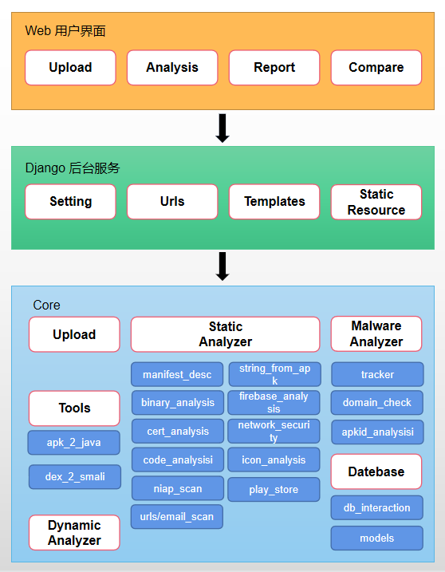
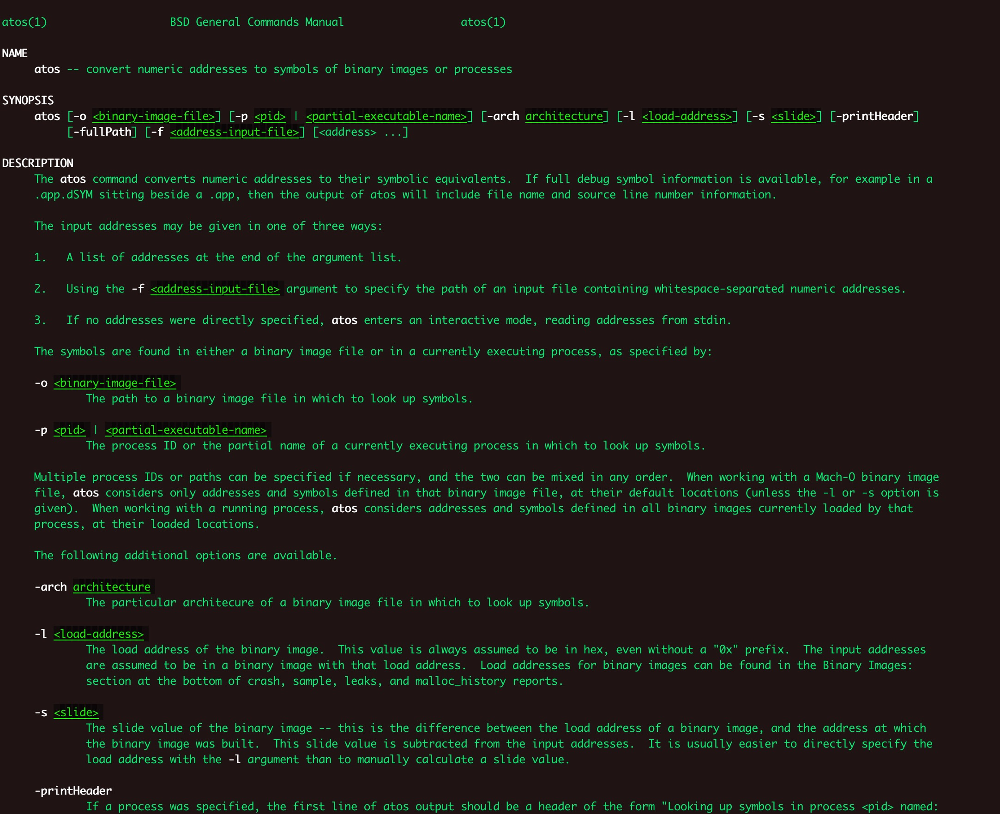

# iOS 静态分析

应用隐私合规产品的开发，暂时告一段落，目前实现的主要功能是静态分析，搜索 APP 中的权限列表及收集的敏感信息，整理权限与 api 的对应关系及敏感信息与 api 的对应关系，并确定 api 所在的具体文件、方法、行号，从而给出相应的提示。这里最重要的就是如何进行静态分析以及如何获取 api 在文件中的具体位置，下面就整理下具体的思路及细节。

## MobSF

说到静态分析与动态分析，肯定绕不开 MobSF，本文所讲的 iOS 静态分析也主要是借鉴 MobSF 的思路，这里先对 MobSF 做一个简单的介绍。

移动安全框架 (MobSF) 是一个智能化、一体化的开源移动应用（Android / iOS）自动测试框架，能够对以上两种移动应用进行静态和动态分析（动态分析目前暂时只支持Android）。

它可以有效、快速地对应用APK 和 IPA 文件 及压缩的源代码进行审计分析。同时，MobSF 也能够通过其 API Fuzzer 功能模块，对 Web API 的安全性进行检测，如收集信息，分析安全头部信息，识别移动API 的具体漏洞，如 XXE、SSRF、路径遍历，IDOR 以及其他的与会话和 API 调用速率限制有关的逻辑问题。

### MobSF 部署

MobSF 的部署，这里不做赘述，请直接参考 [MobSF 官网](https://mobsf.github.io/docs/#/)。着重说一下需要注意的地方，在 Linux/Mac 上，一定要安装 Windows VM，才能启动 MobSF 的服务。为了规避平台差异性，建议直接使用 Docker 启动 MobSF 服务，方便快捷，无需安装各种依赖环境。

### MobSF 架构分析

**项目结构**



**Web 用户界面**

Web 用户界面主要用于提供用户操作的分析界面，用于上传应用，静态分析、动态分析、查看分析结果、导出 pdf 报告、分析比对。

**Django 后台**

后台服务用于连接用户界面/API 接口与核心逻辑之间的交互，实现用户请求响应功能

- **mobsf/MobSF/setting.py** 通过统一的配置文件管理整个框架的所有配置，包含日志打印控制 `LOGGING`、模板配置 `TEMPLATES`、应用模块配置 `INSTALLED_APPS`、数据库配置 `DATABASES`、工作空间/资源文件/数据库/工具/模板等配置、最大文件上传大小限制 `DATA_UPLOAD_MAX_MEMORY_SIZE`、`class` 扫描排除配置 `SKIP_CLASS_PATH` 等

- **mobsf/MobSF/urls.py** 统一管理前台界面的所有 api 请求映射/路由表

- **mobsf/template** 前端界面模板 general、静态分析结果模板 static_analysis、动态分析结果模板 dynamic_analysis、报告模板 pdf

- **mobsf/static** 前端网页静态资源集合，包含 js、css、font、img

- **utils.py** 公共基础函数集合

**Core 核心模块**

核心模块包含文件上传、静态分析、动态分析、数据库、三方工具，组合起来实现完整的应用分析框架。

- **Upload(mobsf/MobSF/views/home.py class Upload)** 对外提供 Web 界面应用上传与 API 接口上传功能，as_view->upload_html 用来响应 Web 界面按钮上传或者拖拽上传，upload_api 用来响应 api/v1/upload 接口上传

- **Scanning(mobsf/MobSF/views/scanning.py class Scanning)** 对外提供静态分析功能，Web 上传完成后通过 static_analyzer(mobsf/StaticAnalyzer/views/android/static_analyzer.py) 接口启动静态分析，scan 接口直接调用 static_analyzer 接口启动静态分析

- **MalwareDomainCheck(mobsf\MalwareAnalyzer)** 包含 
  - APKid 分析，分析应用编译相关配置信息
  - 恶意域名检查，与恶意域名清单(mobsf/signatures/malwaredomainlist)比对检查是否为恶意域名，域名地址定位
  - Trackers 分析，借助 εxodus 分析应用引入了哪些追踪器
  - PDF report 导出 PDF 报告，pdf/api_pdf_report 接口 调用 pdf(mobsf/StaticAnalyzer/views/shared_func.py)
  - 通过 md5 查询保存的分析结果（StaticAnalyzerXXX.objects.filter(MD5)）
  - 根据指定的报告模板(mobsf/templates/pdf)文件生成模板(handle_pdf_xxx shared_func.py)，将分析结果转换为格式化的 html 内容(html=template.render(context))
  - 将 html 内容转换为 pdf 文档内容(pdfkit.from_string(html, False, options=options), 其中第二个参数可指定输出文件，直接保存为 pdf 文件)
- 应用安全等级打分 score(mobsf/StaticAnalyzer/views/shared_func.py)
- HTML 模板生成 html 文件，借助 django 的 template 模块 from django.template.loader import get_template 的 get_template 接口，导入指定的 html 模板文件生成模板 Template (django/template/base.py)对象，然后调用其 render方法将内容填充进 html 模板内，生成 html 内容
 - settings.py 内模板配置
    
    ```python
    TEMPLATES = [
    {
        'BACKEND': 'django.template.backends.django.DjangoTemplates',
        'APP_DIRS': True,
        'DIRS':
            [
                os.path.join(BASE_DIR, 'templates'),
            ],
        'OPTIONS':
            {
                'debug': True,
            },
    },
]
    ```

  - 初始化 django 指定模板配置
    
    ```python
    os.environ.setdefault('DJANGO_SETTINGS_MODULE', 'settings')
django.setup()
    ```

  - 根据 html 模板生成 Template 对象
    
    ```python
    template = get_template(‘pdf/android_report.html’)
    ```

  - 调用 render 方法生成 html
    
    ```python
    html = template.render(context)
    ```

    由于 html 模板使用了一些自定义的模板标签和过滤器，用于扩展 django 模板标签语法，所以需要注册自定义的过滤器

    注册 key 标签如下：
    
    ```python
    from django.template.defaulttags import register
    # 注册 template 自定义过滤器
    @register.filter
    def key(d, key_name):
        """To get dict element by key name in template."""
        return d.get(key_name)
    ```
    
    html 模板内使用示例 details|key:"bad" 获取 details 字典中 key 为 "bad" 的值

## 实现思路

这里主要借鉴 MobSF 的实现方式，MobSF 对 ipa 静态分析之后，可得到如下结果：

1. APP 概述 - 包括根据 MobSF 打分系统对 APP 的最终评分、文件类型、版本信息等
2. 扫描项 - Info.plist、Strings、Class Dump
3. 自定义 URL Schemes - 可分析 APP 的跨应用跳转情况
4. 应用所申请的权限列表 - 应用合规的重要参考项
5. ATS 配置 - 对允许使用 http 的接口进行提示
6. ipa 二进制分析结果
7. 文件分析 - 如 plist 文件、rsa 密钥等
8. 服务分布于域名检测 - 根据域名，列出其对应的 ip、国家、地区、城市、经度、纬度
9. URLS - APP 内所有使用到的接口 URL
10. Firebase Database
11. Emails
12. 文件列表 - 包含图片、xib 等

根据这些结果，已经能够满足我们 90% 的需求，但是，其中一个非常非常重要的地方，MobSF 并没有提供解决方案：如何获取 api 对应的具体位置(包括类名、方法名、行号)？

下面就跟着 MobSF，从入口函数开始，逐步分析如何实现 Mach-O 文件的静态分析。

### 解压缩

直接使用 python 的 zipfile 库即可实现 ipa 文件的解压缩，需要注意的是，文件名中包含中文时，很可能会产生乱码，这里给出解决中文乱码的参考代码：

```python
def unzip(app_path, ext_path):
    logger.info('Unzipping')
    try:
        files = []
        with zipfile.ZipFile(app_path, 'r') as zipptr:
            for fileinfo in zipptr.infolist():
                filename = fileinfo.filename
                if not isinstance(filename, str):
                    filename = str(filename, encoding='utf-8', errors='replace')
                    filename = filename.encode('cp437').decode('gbk')
                else:
                    filename = filename.encode('cp437').decode('gbk')
                files.append(filename)
                zipptr.extract(filename, ext_path)
        return files
    except Exception:
        logger.exception('Unzipping Error')
```

### 获取解压缩后的全部文件

ipa 解压完成之后，会生成一个 Payload 目录，Payload 的目录下是对应 .app 文件，进入该 .app 文件即可看到 ipa 的所有资源文件及可执行文件。通过 python 遍历该目录，即可拿到所有文件。

### Info.plist 解析

通过上面的步骤，即可拿到 app 的 Info.plist 文件，然后，就可以从 plist 中读取 app 的相关信息，如 app 名称、版本等等，这里重要的是申请的权限列表、ATS 配置、Scheme 配置。

### Mach-O 文件分析

针对 Mach-O 文件的分析，是 iOS 静态分析的核心，这里主要借助 python 的 lief 库实现 Mach-O 文件的分析。

```python
import lief

class Checksec:
    def __init__(self, macho):
        self.macho = lief.parse(macho.as_posix())
```

要想知道如何分析 Mach-O 文件，首先需要对 Mach-O 文件非常地了解，网上有大量介绍 Mach-O 的文章，这里我就不再赘述了，推荐两篇文章：

- [Mach-O 文件结构理解](https://jianli2017.top/wiki/IOS/MachO/MachO_FileStructure/)
- [探秘 Mach-O 文件](http://hawk0620.github.io/blog/2018/03/22/study-mach-o-file/)

了解了 Mach-O 文件之后，就需要了解 lief 库关于 Mach-O 的 api，这个需要仔细阅读 [lief 的文档](https://lief.quarkslab.com/doc/latest/api/python/macho.html#lief.MachO.LOAD_COMMAND_TYPES)

通过 lief 库解析之后，基本就能拿到大部分静态分析需要的内容了，当然，还可以结合 classdump 工具拿到更多的信息，另外，还可以使用 Mac 上的 strings 工具获取 Mach-O 中的字符串信息。

现在的问题是，通过静态分析，扫描到了敏感的 api，那么如何获取该 api 对应的具体位置呢(包括类名、方法名、行号)？告诉用户有问题，但是不指出具体的问题在哪里，这个就没有任何价值，比如，假如一个 crash 收集框架，只告诉你发生了 crash，但是不告诉你是哪个方法哪一行导致的 crash，你会用吗？

### api 定位

我们知道，Mach-O 的 Data 部分是存放数据与代码的，其中的 **__TEXT** 段包含了执行代码及其它只读数据，其中 **__TEXT** 段的 **__text** 节中存放的即为代码实现，所以，需要先将 **__text** 节中的伪代码输出到文件中，这里，使用 otool 命令实现该功能，代码如下：

```python
# 先调用 otool -tV <binary path> 输出 __TEXT 段 __text 节中的伪代码
filenamearr = filename.split('.')
if len(filenamearr) > 1:
    filename = filenamearr[0]
app_bin_path = app_bin_dir + filename + '.app/' + filename
print("\r\n---------- app_bin_path ----------")
print(app_bin_path)
print("---------- app_bin_path ----------\r\n")

otool_cmd = "otool -tV %s" % app_bin_path
content_of_text_section_in_text_segment = subprocess.check_output(otool_cmd.split())
print("\r\n---------- content_of_text_section_in_text_segment ----------")
print(type(content_of_text_section_in_text_segment))
print("---------- content_of_text_section_in_text_segment ----------\r\n")
with open(os.path.join(app_dir, 'content_of_text_section_in_text_segment.txt'), 'wb') as flip:
    flip.write(content_of_text_section_in_text_segment)
```

这样就拿到了伪代码，具体内容如下所示(整个文件内容太多，这里截取前面的小部分进行展示)：

```
/Users/noctis/Downloads/GTCaptchaResult/Payload/GT3DevTest.app/GT3DevTest:
(__TEXT,__text) section
0000000100005e90	sub	sp, sp, #0xd0
0000000100005e94	stp	x29, x30, [sp, #0xc0]
0000000100005e98	add	x29, sp, #0xc0
0000000100005e9c	stur	x0, [x29, #-0x8]
0000000100005ea0	stur	x1, [x29, #-0x10]
0000000100005ea4	ldur	x8, [x29, #-0x8]
0000000100005ea8	sub	x9, x29, #0x20
0000000100005eac	stur	x8, [x29, #-0x20]
0000000100005eb0	adrp	x8, 483 ; 0x1001e8000
0000000100005eb4	add	x8, x8, #0xcf8 ; Objc class ref: EnvSettingTableViewController
0000000100005eb8	ldr	x8, [x8]
0000000100005ebc	str	x8, [x9, #0x8]
0000000100005ec0	adrp	x8, 478 ; 0x1001e3000
0000000100005ec4	add	x8, x8, #0x130 ; Objc selector ref: viewDidLoad
0000000100005ec8	ldr	x1, [x8]
0000000100005ecc	mov	x0, x9
0000000100005ed0	bl	0x1001580a4 ; Objc message: -[[x0 super] viewDidLoad]
0000000100005ed4	adrp	x8, 483 ; 0x1001e8000
0000000100005ed8	add	x8, x8, #0x228 ; Objc class ref: _OBJC_CLASS_$_UIColor
0000000100005edc	ldr	x0, [x8]
0000000100005ee0	adrp	x8, 478 ; 0x1001e3000
0000000100005ee4	add	x8, x8, #0x138 ; Objc selector ref: whiteColor
0000000100005ee8	ldr	x1, [x8]
0000000100005eec	bl	0x100158098 ; Objc message: +[UIColor whiteColor]
0000000100005ef0	mov	x29, x29
0000000100005ef4	bl	0x1001580ec ; symbol stub for: _objc_retainAutoreleasedReturnValue
0000000100005ef8	ldur	x8, [x29, #-0x8]
0000000100005efc	adrp	x9, 478 ; 0x1001e3000
0000000100005f00	add	x9, x9, #0x140 ; Objc selector ref: view
0000000100005f04	ldr	x1, [x9]
0000000100005f08	stur	x0, [x29, #-0x38]
0000000100005f0c	mov	x0, x8
0000000100005f10	bl	0x100158098 ; Objc message: -[x0 view]
0000000100005f14	mov	x29, x29
0000000100005f18	bl	0x1001580ec ; symbol stub for: _objc_retainAutoreleasedReturnValue
0000000100005f1c	adrp	x8, 478 ; 0x1001e3000
0000000100005f20	add	x8, x8, #0x148 ; Objc selector ref: setBackgroundColor:
0000000100005f24	ldr	x1, [x8]
0000000100005f28	stur	x0, [x29, #-0x40]
0000000100005f2c	ldur	x2, [x29, #-0x38]
0000000100005f30	bl	0x100158098 ; Objc message: -[x0 setBackgroundColor:]
0000000100005f34	ldur	x0, [x29, #-0x40]
0000000100005f38	bl	0x1001580bc ; symbol stub for: _objc_release
0000000100005f3c	ldur	x0, [x29, #-0x38]
0000000100005f40	bl	0x1001580bc ; symbol stub for: _objc_release
0000000100005f44	ldur	x0, [x29, #-0x8]
0000000100005f48	adrp	x8, 478 ; 0x1001e3000
0000000100005f4c	add	x8, x8, #0x150 ; Objc selector ref: setTitle:
0000000100005f50	ldr	x1, [x8]
0000000100005f54	adrp	x2, 389 ; 0x10018a000
0000000100005f58	add	x2, x2, #0xdc8 ; Objc cfstring ref: @"¾‹n¯sƒX"
0000000100005f5c	bl	0x100158098 ; Objc message: -[x0 setTitle:]
0000000100005f60	ldur	x0, [x29, #-0x8]
0000000100005f64	adrp	x8, 478 ; 0x1001e3000
0000000100005f68	add	x8, x8, #0x158 ; Objc selector ref: tableView
0000000100005f6c	ldr	x1, [x8]
0000000100005f70	stur	x8, [x29, #-0x48]
0000000100005f74	bl	0x100158098 ; Objc message: -[x0 tableView]
0000000100005f78	mov	x29, x29
0000000100005f7c	bl	0x1001580ec ; symbol stub for: _objc_retainAutoreleasedReturnValue
0000000100005f80	adrp	x8, 483 ; 0x1001e8000
0000000100005f84	add	x8, x8, #0x230 ; Objc class ref: EnvTableViewCell
0000000100005f88	ldr	x8, [x8]
0000000100005f8c	adrp	x9, 478 ; 0x1001e3000
0000000100005f90	add	x9, x9, #0x160 ; Objc selector ref: class
0000000100005f94	ldr	x1, [x9]
0000000100005f98	stur	x0, [x29, #-0x50]
0000000100005f9c	mov	x0, x8
0000000100005fa0	bl	0x100158098 ; Objc message: +[EnvTableViewCell class]
0000000100005fa4	adrp	x8, 478 ; 0x1001e3000
0000000100005fa8	add	x8, x8, #0x168 ; Objc selector ref: registerClass:forCellReuseIdentifier:
0000000100005fac	ldr	x1, [x8]
0000000100005fb0	ldur	x2, [x29, #-0x50]
0000000100005fb4	stur	x0, [x29, #-0x58]
0000000100005fb8	mov	x0, x2
0000000100005fbc	ldur	x2, [x29, #-0x58]
0000000100005fc0	adrp	x3, 389 ; 0x10018a000
0000000100005fc4	add	x3, x3, #0xda8 ; Objc cfstring ref: @"reuseIdentifier"
0000000100005fc8	bl	0x100158098 ; Objc message: -[x0 registerClass:forCellReuseIdentifier:]
0000000100005fcc	ldur	x0, [x29, #-0x50]
0000000100005fd0	bl	0x1001580bc ; symbol stub for: _objc_release
0000000100005fd4	ldur	x2, [x29, #-0x8]
0000000100005fd8	ldur	x0, [x29, #-0x8]
0000000100005fdc	ldur	x8, [x29, #-0x48]
0000000100005fe0	ldr	x1, [x8]
0000000100005fe4	str	x2, [sp, #0x60]
0000000100005fe8	bl	0x100158098 ; Objc message: -[x0 registerClass:forCellReuseIdentifier:]
0000000100005fec	mov	x29, x29
0000000100005ff0	bl	0x1001580ec ; symbol stub for: _objc_retainAutoreleasedReturnValue
0000000100005ff4	adrp	x8, 478 ; 0x1001e3000
0000000100005ff8	add	x8, x8, #0x170 ; Objc selector ref: setDelegate:
0000000100005ffc	ldr	x1, [x8]
0000000100006000	str	x0, [sp, #0x58]
0000000100006004	ldr	x2, [sp, #0x60]
0000000100006008	bl	0x100158098 ; Objc message: -[x0 setDelegate:]
```

接下来，根据扫描到敏感 api，就可以到伪代码文件中找到该 api 对应的偏移地址，拿到偏移地址后，就可以获取到该偏移地址所属的类、方法及行号了，获取偏移地址方法可参考如下代码：

```python
codemap = []
with open(os.path.join(app_dir, 'content_of_text_section_in_text_segment.txt'), 'rb') as flip:
    while True:
        line = flip.readline()
        if not line:
            break
        else:
            try:
                line = line.decode('utf-8')
                for code in non_compliance_codes:
                    if code in line:
                        # print("\r\n---------- line ----------")
                        # print(line)
                        # print("---------- line ----------\r\n")
                        address = line[0:16]
                        # print("\r\n---------- address ----------")
                        # print(address)
                        # print("---------- address ----------\r\n")
                        map = {}
                        map[code] = address
                        codemap.append(map)
            except:
                pass

print("\r\n---------- codemap ----------")
print(codemap)
print("---------- codemap ----------\r\n")
```

那么，如何根据偏移地址得到所属的类、方法及行号呢？这就需要借助 atos 命令实现，在 Mac 终端中 man 一下 atos，看看其具体的用途及用法：

```shell
$ man atos
```

结果如下：




下面就可以通过 atos 愉快的拿到类、方法及行号了：

```python
non_compliance_info = []

# 再使用 atos -o <binary path> <address> 获取对应偏移地址所属的类与方法
for map in codemap:
    for code, address in map.items():
        atos_cmd = "atos -o" + " " + app_bin_path + " " + address
        atos_info = subprocess.check_output(atos_cmd.split())
        # print("\r\n---------- atos_info ----------")
        # print(atos_info)
        # print("---------- atos_info ----------\r\n")
        map = {}
        map[code] = str(atos_info)
        non_compliance_info.append(map)

print("\r\n---------- non_compliance_info ----------")
print(non_compliance_info)
print("---------- non_compliance_info ----------\r\n")
```

这里截取部分 atos 命令的输出结果作为展示：

```
b'-[CLLocationManager(Doraemon) doraemon_swizzleLocationDelegate:] (in GT3DevTest) (CLLocationManager+Doraemon.m:0)\n'
b'+[DoraemonAppInfoUtil locationAuthority] (in GT3DevTest) (DoraemonAppInfoUtil.m:0)\n'
b'+[DoraemonAppInfoUtil locationAuthority] (in GT3DevTest) (DoraemonAppInfoUtil.m:113)\n'
b'+[DoraemonAppInfoUtil locationAuthority] (in GT3DevTest) (DoraemonAppInfoUtil.m:0)\n'
b'+[DoraemonAppInfoUtil locationAuthority] (in GT3DevTest) (DoraemonAppInfoUtil.m:114)\n'
b'+[DoraemonAppInfoUtil cameraAuthority] (in GT3DevTest) (DoraemonAppInfoUtil.m:0)\n'
b'+[DoraemonAppInfoUtil cameraAuthority] (in GT3DevTest) (DoraemonAppInfoUtil.m:0)\n'
b'+[DoraemonAppInfoUtil cameraAuthority] (in GT3DevTest) (DoraemonAppInfoUtil.m:150)\n'
b'+[DoraemonAppInfoUtil audioAuthority] (in GT3DevTest) (DoraemonAppInfoUtil.m:0)\n'
b'+[DoraemonAppInfoUtil audioAuthority] (in GT3DevTest) (DoraemonAppInfoUtil.m:0)\n'
b'+[DoraemonAppInfoUtil audioAuthority] (in GT3DevTest) (DoraemonAppInfoUtil.m:173)\n'
b'+[DoraemonAppInfoUtil photoAuthority] (in GT3DevTest) (DoraemonAppInfoUtil.m:0)\n'
b'+[DoraemonAppInfoUtil photoAuthority] (in GT3DevTest) (DoraemonAppInfoUtil.m:222)\n'
b'+[DoraemonAppInfoUtil addressAuthority] (in GT3DevTest) (DoraemonAppInfoUtil.m:256)\n'
b'+[DoraemonAppInfoUtil addressAuthority] (in GT3DevTest) (DoraemonAppInfoUtil.m:0)\n'
b'+[DoraemonAppInfoUtil addressAuthority] (in GT3DevTest) (DoraemonAppInfoUtil.m:0)\n'
b'+[DoraemonAppInfoUtil addressAuthority] (in GT3DevTest) (DoraemonAppInfoUtil.m:280)\n'
b'+[DoraemonAppInfoUtil addressAuthority] (in GT3DevTest) (DoraemonAppInfoUtil.m:280)\n'
b'+[DoraemonAppInfoUtil calendarAuthority] (in GT3DevTest) (DoraemonAppInfoUtil.m:0)\n'
b'+[DoraemonAppInfoUtil calendarAuthority] (in GT3DevTest) (DoraemonAppInfoUtil.m:305)\n'
b'+[DoraemonAppInfoUtil remindAuthority] (in GT3DevTest) (DoraemonAppInfoUtil.m:0)\n'
b'+[DoraemonAppInfoUtil remindAuthority] (in GT3DevTest) (DoraemonAppInfoUtil.m:327)\n'
b'-[DoraemonGPSMocker swizzleCLLocationMangagerDelegate] (in GT3DevTest) (DoraemonGPSMocker.m:0)\n'
b'-[DoraemonGPSMocker swizzleCLLocationMangagerDelegate] (in GT3DevTest) (DoraemonGPSMocker.m:54)\n'
b'-[DoraemonGPSViewController requestUserLocationAuthor] (in GT3DevTest) (DoraemonGPSViewController.m:0)\n'
b'-[DoraemonGPSViewController requestUserLocationAuthor] (in GT3DevTest) (DoraemonGPSViewController.m:148)\n'
b'-[DoraemonQRCodeTool authJudge] (in GT3DevTest) (DoraemonQRCodeTool.m:0)\n'
b'-[DoraemonQRCodeTool authJudge] (in GT3DevTest) (DoraemonQRCodeTool.m:0)\n'
b'-[DoraemonQRCodeTool authJudge] (in GT3DevTest) (DoraemonQRCodeTool.m:72)\n'
b'-[DoraemonQRCodeTool authJudge] (in GT3DevTest) (DoraemonQRCodeTool.m:0)\n'
b'-[DoraemonQRCodeTool authJudge] (in GT3DevTest) (DoraemonQRCodeTool.m:0)\n'
b'-[DoraemonQRCodeTool authJudge] (in GT3DevTest) (DoraemonQRCodeTool.m:76)\n'
b'-[DoraemonQRCodeTool QRCodeDeviceInitWithVC:WithQRCodeWidth:ScanResults:] (in GT3DevTest) (DoraemonQRCodeTool.m:0)\n'
b'-[DoraemonQRCodeTool QRCodeDeviceInitWithVC:WithQRCodeWidth:ScanResults:] (in GT3DevTest) (DoraemonQRCodeTool.m:0)\n'
b'-[DoraemonQRCodeTool QRCodeDeviceInitWithVC:WithQRCodeWidth:ScanResults:] (in GT3DevTest) (DoraemonQRCodeTool.m:125)\n'
b'-[DoraemonQRCodeTool QRCodeDeviceInitWithVC:WithQRCodeWidth:ScanResults:] (in GT3DevTest) (DoraemonQRCodeTool.m:0)\n'
b'-[DoraemonQRCodeTool QRCodeDeviceInitWithVC:WithQRCodeWidth:ScanResults:] (in GT3DevTest) (DoraemonQRCodeTool.m:130)\n'
b'-[DoraemonQRCodeViewController viewDidLoad] (in GT3DevTest) (DoraemonQRCodeViewController.m:0)\n'
b'-[DoraemonQRCodeViewController viewDidLoad] (in GT3DevTest) (DoraemonQRCodeViewController.m:0)\n'
b'-[DoraemonQRCodeViewController viewDidLoad] (in GT3DevTest) (DoraemonQRCodeViewController.m:42)\n'
b'+[GT3Monitor getIPAddressesWithIPLabel:] (in GT3DevTest) + 136\n'
b'+[GT3Monitor getIPAddressesWithIPLabel:] (in GT3DevTest) + 136\n'
b'+[GT3Monitor getIPAddressesWithIPLabel:] (in GT3DevTest) + 1192\n'
b'-[GT3NetPing runWithHostName:] (in GT3DevTest) + 56\n'
```

对该结果，可通过如下方法，使其更加简单明了：

```python
def splitAtosInfo(atosInfo, appName):
    atosInfo = atosInfo.replace("b'", "")
    atosInfo = atosInfo.replace("'", "")
    atosInfo = atosInfo.replace("\\n", "")
    name = '(in ' + appName + ')' 
    atosInfo = atosInfo.replace(name, "")
    atosArr = atosInfo.split(']')
    return atosInfo
```

处理后的结果如下所示：

```
-[CLLocationManager(Doraemon) doraemon_swizzleLocationDelegate:]  (CLLocationManager+Doraemon.m:0)
+[DoraemonAppInfoUtil locationAuthority]  (DoraemonAppInfoUtil.m:0)
+[DoraemonAppInfoUtil locationAuthority]  (DoraemonAppInfoUtil.m:113)
+[DoraemonAppInfoUtil locationAuthority]  (DoraemonAppInfoUtil.m:0)
+[DoraemonAppInfoUtil locationAuthority]  (DoraemonAppInfoUtil.m:114)
+[DoraemonAppInfoUtil cameraAuthority]  (DoraemonAppInfoUtil.m:0)
+[DoraemonAppInfoUtil cameraAuthority]  (DoraemonAppInfoUtil.m:0)
+[DoraemonAppInfoUtil cameraAuthority]  (DoraemonAppInfoUtil.m:150)
+[DoraemonAppInfoUtil audioAuthority]  (DoraemonAppInfoUtil.m:0)
+[DoraemonAppInfoUtil audioAuthority]  (DoraemonAppInfoUtil.m:0)
+[DoraemonAppInfoUtil audioAuthority]  (DoraemonAppInfoUtil.m:173)
+[DoraemonAppInfoUtil photoAuthority]  (DoraemonAppInfoUtil.m:0)
+[DoraemonAppInfoUtil photoAuthority]  (DoraemonAppInfoUtil.m:222)
+[DoraemonAppInfoUtil addressAuthority]  (DoraemonAppInfoUtil.m:256)
+[DoraemonAppInfoUtil addressAuthority]  (DoraemonAppInfoUtil.m:0)
+[DoraemonAppInfoUtil addressAuthority]  (DoraemonAppInfoUtil.m:0)
+[DoraemonAppInfoUtil addressAuthority]  (DoraemonAppInfoUtil.m:280)
+[DoraemonAppInfoUtil addressAuthority]  (DoraemonAppInfoUtil.m:280)
+[DoraemonAppInfoUtil calendarAuthority]  (DoraemonAppInfoUtil.m:0)
+[DoraemonAppInfoUtil calendarAuthority]  (DoraemonAppInfoUtil.m:305)
+[DoraemonAppInfoUtil remindAuthority]  (DoraemonAppInfoUtil.m:0)
+[DoraemonAppInfoUtil remindAuthority]  (DoraemonAppInfoUtil.m:327)
-[DoraemonGPSMocker swizzleCLLocationMangagerDelegate]  (DoraemonGPSMocker.m:0)
-[DoraemonGPSMocker swizzleCLLocationMangagerDelegate]  (DoraemonGPSMocker.m:54)
-[DoraemonGPSViewController requestUserLocationAuthor]  (DoraemonGPSViewController.m:0)
-[DoraemonGPSViewController requestUserLocationAuthor]  (DoraemonGPSViewController.m:148)
-[DoraemonQRCodeTool authJudge]  (DoraemonQRCodeTool.m:0)
-[DoraemonQRCodeTool authJudge]  (DoraemonQRCodeTool.m:0)
-[DoraemonQRCodeTool authJudge]  (DoraemonQRCodeTool.m:72)
-[DoraemonQRCodeTool authJudge]  (DoraemonQRCodeTool.m:0)
-[DoraemonQRCodeTool authJudge]  (DoraemonQRCodeTool.m:0)
-[DoraemonQRCodeTool authJudge]  (DoraemonQRCodeTool.m:76)
-[DoraemonQRCodeTool QRCodeDeviceInitWithVC:WithQRCodeWidth:ScanResults:]  (DoraemonQRCodeTool.m:0)
-[DoraemonQRCodeTool QRCodeDeviceInitWithVC:WithQRCodeWidth:ScanResults:]  (DoraemonQRCodeTool.m:0)
-[DoraemonQRCodeTool QRCodeDeviceInitWithVC:WithQRCodeWidth:ScanResults:]  (DoraemonQRCodeTool.m:125)
-[DoraemonQRCodeTool QRCodeDeviceInitWithVC:WithQRCodeWidth:ScanResults:]  (DoraemonQRCodeTool.m:0)
-[DoraemonQRCodeTool QRCodeDeviceInitWithVC:WithQRCodeWidth:ScanResults:]  (DoraemonQRCodeTool.m:130)
-[DoraemonQRCodeViewController viewDidLoad]  (DoraemonQRCodeViewController.m:0)
-[DoraemonQRCodeViewController viewDidLoad]  (DoraemonQRCodeViewController.m:0)
-[DoraemonQRCodeViewController viewDidLoad]  (DoraemonQRCodeViewController.m:42)
+[GT3Monitor getIPAddressesWithIPLabel:]  + 136
+[GT3Monitor getIPAddressesWithIPLabel:]  + 136
+[GT3Monitor getIPAddressesWithIPLabel:]  + 1192
-[GT3NetPing runWithHostName:]  + 56
```

对于该扫描结果主要注意的一点是，当行号为 0 时，表示该字符串出现在了对应方法实现的 [] 或者 () 中，比如：`-[DoraemonQRCodeTool authJudge]  (DoraemonQRCodeTool.m:0)` 表示的是 `DoraemonQRCodeTool` 类的 `authJudge` 方法中出现了 `AVCaptureDevice`，然后 `AVCaptureDevice` 是以如下形式出现的：

```objc
- (NSString *)authJudge {
    if ([[AVCaptureDevice devicesWithMediaType:AVMediaTypeVideo] count] <= 0) {
        return  @"没有相机";
    }
    
    if([AVCaptureDevice authorizationStatusForMediaType:AVMediaTypeVideo] == AVAuthorizationStatusDenied) {
        
        return @"没有权限";
    }
    return nil;
}
```

至此，iOS 静态分析的重难点就攻克了，拿到了扫描结果后，就可以根据具体的需求进行组合展示了。这里也可以直接借鉴 MobSF，通过 django 的 html 模板，将扫描拿到的 json 映射到 html 模板中，即可漂亮的展示出静态分析的结果。当然，也可以通过 jinja2，自定义模板进行展示。

## 总结

完成 iOS 静态分析最重要的几点：

1. 一定要非常熟悉 Mach-O 文件的结构
2. 熟悉 MobSF 的源码
3. 熟悉 lief 库的相关 api
4. 熟悉 classdump、otool、atos 等其它分析 Mach-O 文件的工具

本次在获取 api 对应类名、方法名及行号的实现中走了些弯路，开始一直想着要通过 lief 库来直接实现该功能，为此花了很多时间去阅读 lief 的文档，但最终并未能通过 lief 库达到目的。主要原因还是对其他分析 Mach-O 文件的工具不熟悉，在此记一笔，避免以后再犯同样的错误。


## 巨人的肩膀

[探秘 Mach-O 文件](http://hawk0620.github.io/blog/2018/03/22/study-mach-o-file/)

[Mach-O文件结构理解](https://jianli2017.top/wiki/IOS/MachO/MachO_FileStructure/)

[How to Symbolize OSX Crash Logs](https://gist.github.com/bmatcuk/c55a0dd4f8775a3a2c5a)

[iOS 敏感词检查](https://www.jianshu.com/p/baeb63c6e5d2)

[LIEF Documentation](https://lief.quarkslab.com/doc/latest/api/python/macho.html#lief.MachO.LOAD_COMMAND_TYPES)