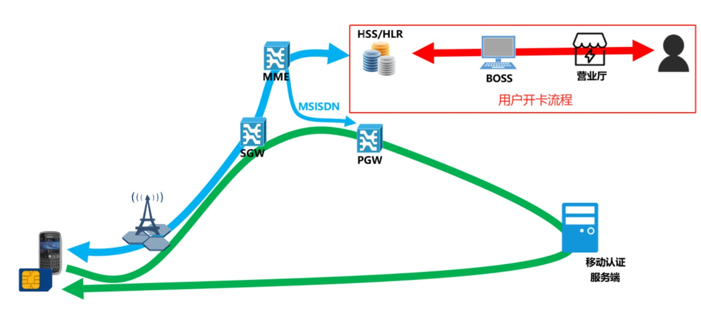

# 概述

网关取号是基于运营商网络特有的登录方式，可在有 sim 卡且在移动通信数据网络上的设备上实现应用免密码登录，获取手机号码时延短，在 App 应用上主推的认证手段，通过运营商核心网网元数据网关（PGW）插入用户手机号码，并由移动认证完成用户账号身份识别，是替代短信验证码的一种可靠验证方式。

# 名词解释

1. PGW（数据网关）：PDN 网关，在 EPC 系统中引入的 PGW 网元实体，其英文全称为 PDN Gateway，它类似于 GGSN 网元的功能，为 EPC 网络的边界网关，提供用户的会话管理和承载控制、数据转发、IP 地址分配以及非 3GPP 用户接入等功能
2. HLR：归属位置寄存器，HLR 是一个静态数据库，用来存储本地用户数据信息的数据库
3. HSS：归属签约用户服务器（Home Subscriber Server，HSS）是 3GPP 在 R5 引入 IMS 时提出的概念，其功能与 HLR 类似但更加强大，支持更多接口，可以处理更多的用户信息
4. SGW：SGW（Serving GateWay，服务网关）是移动通信网络 EPC 中的重要网元。EPC 网络实际上是原 3G 核心网 PS 域的演进版本，而 SGW 的功能和作用与原 3G 核心网 SGSN 网元的用户面相当
5. SIM：SIM 卡是（Subscriber Identification Module ），也称为用户身份识别卡、智能卡，GSM 数字移动电话机必须装上此卡方能使用。在 SIM 芯片上存储了数字移动电话客户的信息，加密的密钥以及用户的电话簿等内容，可供运营商网络客户身份进行鉴别，并对客户通话时的语音信息进行加密
6. MME：MME（Mobility Management Entity）是 3GPP 协议 LTE 接入网络的关键控制节点，它负责空闲模式的 UE(User Equipment) 的定位，传呼过程，包括中继，简单的说 MME 是负责信令处理部分
7. BOSS：BOSS(Business & Operation Support System)，业务运营支撑系统（BOSS）涵盖了以往的计费、结算、营业、账务和客户服务等系统的功能，对各种业务功能进行集中、统一的规划和整合
8. RSA：RSA 加密算法是一种非对称加密算法，使用不同的加密密钥与解密密钥，是一种“由已知加密密钥推导出解密密钥在计算上是不可行的”密码体制
9. AES：一种对称分组加密算法
10. MSISDN：（Mobile Subscriber International ISDN/PSTN number），移动用户唯一标识码（即移动用户的手机号码）
11. UE：（User Equipment），用户通信终端
12. IMSI：（International Mobile Subscriber Identity），国际移动用户识别码，是用于区分蜂窝网络中不同用户的、在所有蜂窝网络中不重复的识别码。手机将 IMSI 存储于一个 64 比特的字段发送给网络。IMSI 可以用来在归属位置寄存器或拜访位置寄存器中查询用户的信息
13. 流量卡：指在安装了两张 sim 卡的终端中，用于发起数据流量请求上网的 sim 卡
14. keystore：Keytool 是一个 Java 数据证书的管理工具, Keytool 将密钥（key）和证书（certificates）存在一个称为 keystore 的文件中

# 原理解析

## 1、用户开卡流程

	

1. 用户前往营业厅办理开卡业务
2. 营业厅完成对用户的实名身份信息验证，申请空白 sim 卡，并将 sim 卡的信息和用户信息一并提交到后台 BOSS 系统登记处理
3. 核心网接收到新用户开卡的请求，由 HLR 网元记录 sim 卡的相关信息和对应的手机号码 MSISDN，并在后台完成 sim 卡和手机号的激活步骤 
4. 后台响应营业厅，完成了用户的新开卡的入网申请，营业厅将已经激活的 sim 卡给到用户手上

至此，用户开卡流程完成，此时，只要卡账号内有余额，用户就可以将 sim 卡插入到手机上进行打电话、上网的操作

## 2、sim 卡鉴权流程

运营商为了确保接入网络的用户身份可靠性、合法性，在用户使用网络（通
话，上网）之前，需要对用户的手机卡（UE）做一次鉴权，确保卡身份合法安全才允许手机终端接入运营商的网络。具体鉴权流程的步骤如下：

1. UE 向核心网（MME）发送自己的 IMSI 与 HSS 标记 IDHSS 标识等身份信息，请求接入网络
2. MME 根据请求 IDHSS，向对应的 HSS 发送鉴权数据请求，在请求中包括有用户的身份信息 IMSI 与本服务网的身份信息 SNID
3. HSS 收到鉴权请求后，在自己的数据库中查找 IMSI 与 SNID，验证这 2 个实体的合法性。如果验证通过，则生成鉴权向量组 AV（1,…,n）
4. HSS 将生成的鉴权向量组 AV（1,…,n）作为鉴权数据响应，发回给 MME
5. MME 收到应答后，存储 AV（1,…,n），再从中选择一个 AV(i)，提取出 RAND(i)、AUTN(i)、KASME(i)等数据，同时为 KASME(i)分配一个密钥标识 KSIASME(i)
6. MME 向 UE 发送用户认证请求，带有 RAND(i)、AUTN(i)、KASME(i) 等数据
7. UE 收到认证请求后，通过提取和计算 AUTN(i) 中的 MAC 等信息，计算 XMAC，比较 XMAC 和 MAC 是否相等，同时检验序列号 SQN 是否在正常的范围内，以此来认证所接入的网络
8. UE 给 MME 发用户鉴权请求响应消息，将计算出的 RES(i) 传输给 MME
9. MME 将收到的 RES(i) 与 AV(i) 中的 XRES(i) 进行比较，如果一致，则通过认证
10. 在双向认证都完成后，MME 与 UE 将 KASME(i) 作为基础密钥，根据约定的算法推演出加密密钥 CK 与完整性保护密钥 IK，随后进行保密通信

## 3、网关插号流程

在 UE 附着到网络的过程中，HLR/HSS 将用户的手机号码等信息传递到 PGW，用户成功附着到网络以后，当地的 PGW 将同时保存了用户的手机号码信息，此时，用户的手机终端将可以进行通话、上网等操作

用户在使用一键登录业务时，经过运营商核心网数据网管，将插入用户正在使用的上网流量卡的手机号码

主要流程包括（绿色路径）：

1. 用户手机终端完成网络附着和鉴权流程；
2. 手机发起一条网络请求经过基站到达本地的核心网
3. 在经过 SGW 时，SGW 将请求路由到本地的 PGW 网元
4. 在经过 PGW 时，PGW 根据发起本次请求的用户的相关信息，查询用户的身份，在确认用户身份后，在本次请求的报文中插入用户的 MSISDN 信息
5. PGW 将请求转发到目标地址服务器，也就是移动认证的取号服务器
6. 移动认证取号服务器根据报文解析出 MSISDN 信息
7. 移动认证取号服务器根据 MSISDN 生成对应的取号凭证信息，并返回给用户手机终端
8. 完成预取号流程

**其中，最关键的是第 4 步，即 PGW 是如何根据用户发起的请求来确定用户信息的，此处推测，是在 LTE 协议中会携带 SIM 卡相关信息，基站根据终端发起的请求即可查询到用户信息**

**LTE 协议对应到具体的 OSI 七层模型中，LTE 协议应该处于数据链路层**