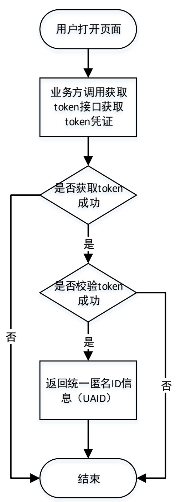
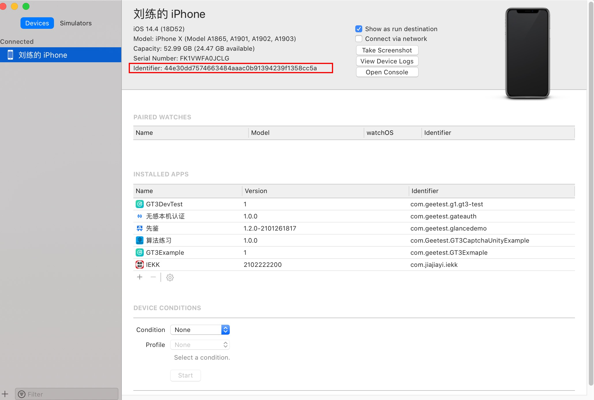
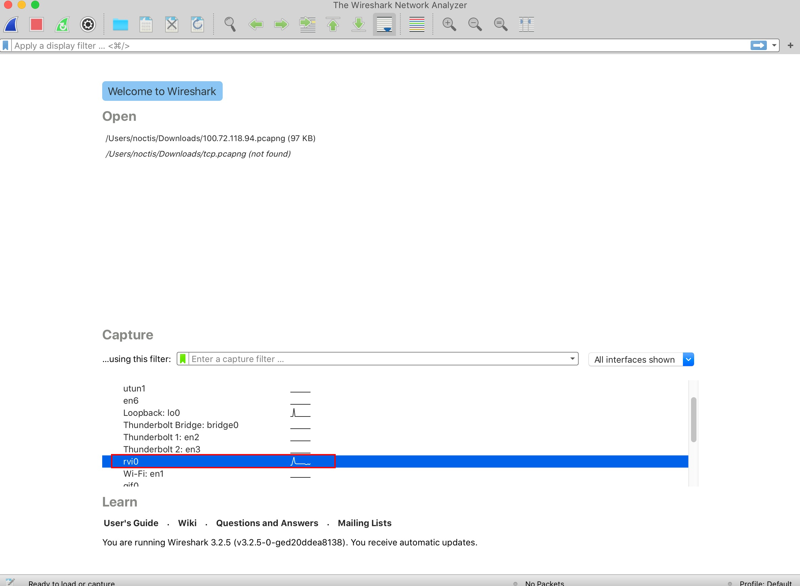
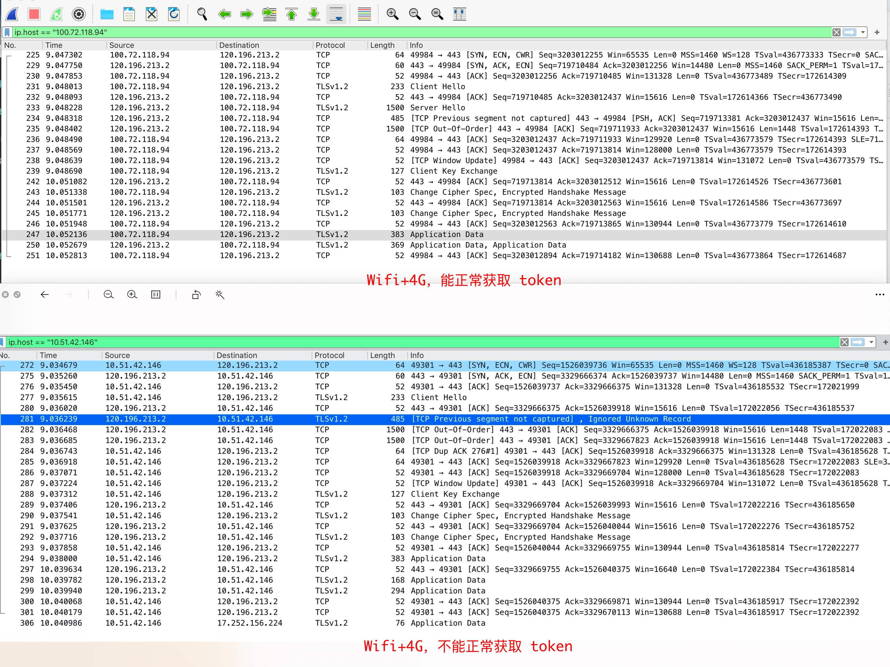
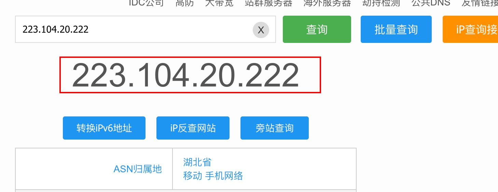
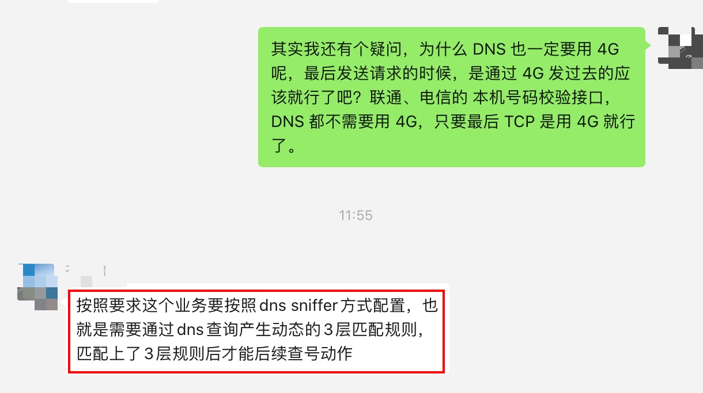
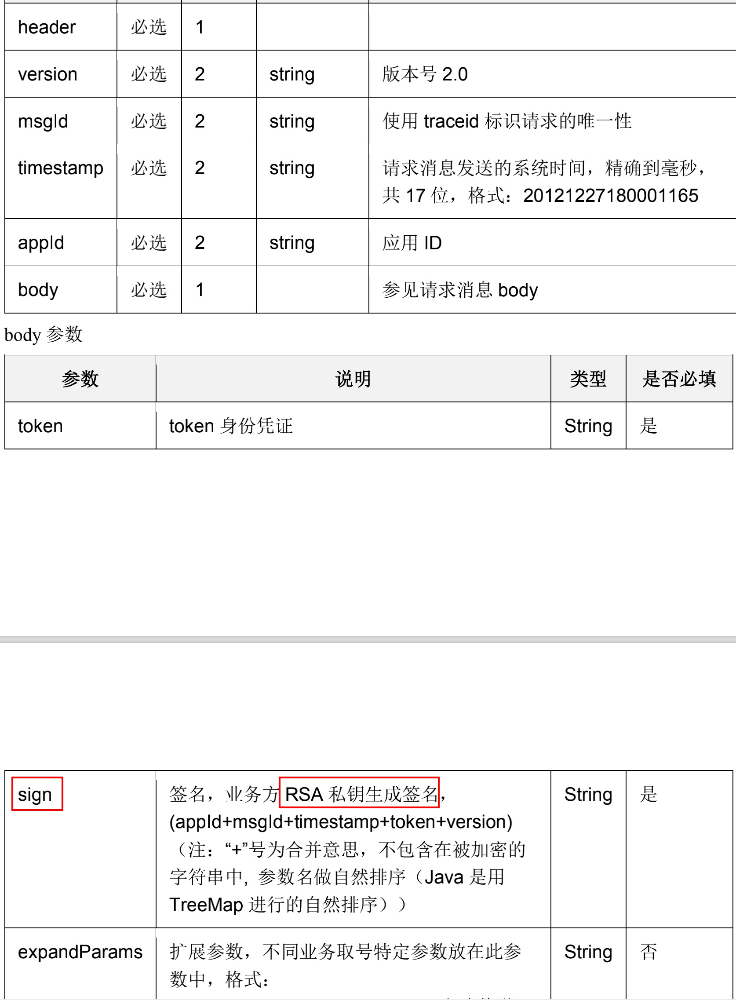

# 移动 UAID 调试中的问题及总结

## 产品介绍

移动认证 UAID(uniform anonymous identity，统一匿名 ID) 产品是通过移动网关取号能力识别设备标识，并生成对应的 UAID 信息返回给业务方，业务方可以通过此标识符进行用户标识等。

具体业务流程图如下：



**流程说明：**

1. 用户打开客户端页面
2. 业务方调用接口获取 token 接口获取 token 凭证
3. 获取 token 失败结束流程
4. 获取 token 成功并校验 token 成功后返回移动认证 UAID 信息

该流程与运营商的 **本机号码校验** 流程基本一致，**本机号码校验** 是客户端先通过运营商的接口获取 token，获取到 token 之后，用该 token 到服务端去校验，服务端返回当前使用手机号是否为本机号码。此次为了先测试 UAID 功能，没有搭建服务端，将校验 token 的步骤也放到了客户端。

## 实现原理

获取 token 的核心在于要通过 **蜂窝移动网络** 给运营商提供的接口发送数据请求，当手机只开了 `4G`，而没有开 `Wifi` 时，直接通过 `HTTPS` 协议，按照接口文档传参调用接口，即可以很容易实现 `token` 的获取，但是在手机既开了 `Wifi` 又开了 `4G`(**注意：这里的 4G 代指蜂窝移动网络，为了书写方便，下文还会有很多地方使用 4G 来代指蜂窝移动网络，2G/3G/4G/5G 都是蜂窝移动网络**) 时，要如何让手机也通过 `4G` 发送数据请求呢？

在 `Wifi + 4G` 的网络情况下，就不能直接使用 `HTTPS` 调用接口了，而必须通过 `BSD Socket` 的 `api` 来实现强制使用 `4G` 进行数据发送的功能。

这里提供两种实现强制使用 `4G` 进行数据发送功能的方法：

1. 使用 `IP_BOUND_IF` 的方式切换网卡

    * 使用 `"ifaddrs.h"` 中的 `"getifaddrs"` 来获取 `interface addresses`:
    
    ```
    struct ifaddrs *interfaces = NULL;
    struct ifaddrs *temp_addr = NULL;
    NSInteger success = getifaddrs(&interfaces);
    if (success == 0) {
        // Loop through linked list of interfaces
        temp_addr = interfaces;
        while (temp_addr != NULL) {
            if (temp_addr->ifa_addr->sa_family == AF_INET) {
                // Get NSString from C String
                NSString* ifaName = [NSString stringWithUTF8String:temp_addr->ifa_name];
                NSString* address = [NSString stringWithUTF8String:inet_ntoa(((struct sockaddr_in *) temp_addr->ifa_addr)->sin_addr)];
                NSString* mask = [NSString stringWithUTF8String:inet_ntoa(((struct sockaddr_in *) temp_addr->ifa_netmask)->sin_addr)];
                NSString* gateway = [NSString stringWithUTF8String:inet_ntoa(((struct sockaddr_in *) temp_addr->ifa_dstaddr)->sin_addr)];
                NSLog(@"%@;%@;%@;%@",ifaName,address,mask,gateway);
            }
            temp_addr = temp_addr->ifa_next;
        }
    }
    ```
    
    * 然后可以在控制台看见类似如下信息：

    ```
    lo0;127.0.0.1;255.0.0.0;127.0.0.1
    pdp_ip0;10.57.181.166;255.255.255.255;10.57.181.166
    en0;192.168.1.80;255.255.255.0;192.168.1.255
    en2;169.254.163.106;255.255.0.0;169.254.255.255
    ```
    
    其中 `"pdp_ip0"` 代表蜂窝网络。
    
    * 使用 `"net/if.h"` 中的 `"if_nametoindex"` 和 `"sys/socket.h"` 中的 `"setsockopt"`，向特定的 `interface` 发送消息。

    ```
    int socketFD = socket(AF_INET, SOCK_STREAM, 0); 
    int index = if_nametoindex([@"pdp_ip0" UTF8String]);
    if (-1 == setsockopt(socketFD, IPPROTO_IP, IP_BOUND_IF, &index, sizeof(index))) {
        close(socketFD);
    }
    ```
    
    随后，即可以使用 `socket` 进行网络连接与发送数据，这样就可以在 `Wifi + 4G` 网络下通过 `4G` 发送数据。

2. 使用 `iOS/macOS` 上最常用的 `socket` 三方库 `GCDAsyncSocket`

    通过查看 `GCDAsyncSocket` 源码，可以看到其提供的建立 `socket` 连接的方法中有一个方法如下：
    
    ```
    - (BOOL)connectToHost:(NSString *)host
                   onPort:(uint16_t)port
             viaInterface:(nullable NSString *)interface
              withTimeout:(NSTimeInterval)timeout
                    error:(NSError **)errPtr;
    ```
    
    注意到 `viaInterface` 参数，当该参数传入 **蜂窝网络的内网 ip** 时，即可指定使用 `4G` 进行数据发送。
    
    然后，看看如何获取 **蜂窝网络的内网 ip**：
    
    ```
    #define OL_IOS_CELLULAR    @"pdp_ip0"
    #define OL_IOS_WIFI        @"en0"
    #define OL_IOS_VPN         @"utun0"
    #define OL_IP_ADDR_IPv4    @"ipv4"
    #define OL_IP_ADDR_IPv6    @"ipv6"

    // MARK: - Get IP Address

    + (NSString *)getCellularIPv4Address {
        NSArray *searchArray = @[OL_IOS_CELLULAR @"/" OL_IP_ADDR_IPv4];
        NSDictionary *addresses = [self getIPAddresses];
        __block NSString *address;
        __weak typeof(self) wself = self;
        [searchArray enumerateObjectsUsingBlock:^(NSString *key, NSUInteger idx, BOOL *stop) {
            address = addresses[key];
            // 筛选出IP地址格式
            if ([wself isValidatIP:address]) *stop = YES;
        }];
        return address;
    }
    
    + (NSString *)getCellularIPv6Address {
        NSArray *searchArray = @[OL_IOS_CELLULAR @"/" OL_IP_ADDR_IPv6];
        NSDictionary *addresses = [self getIPAddresses];
        __block NSString *address;
        __weak typeof(self) wself = self;
        [searchArray enumerateObjectsUsingBlock:^(NSString *key, NSUInteger idx, BOOL *stop) {
            address = addresses[key];
            // 筛选出IP地址格式
            if ([wself isValidatIP:address]) *stop = YES;
        }];
        return address;
    }
    
    + (NSString *)getCellularAddress {
        NSArray *searchArray = @[OL_IOS_CELLULAR @"/" OL_IP_ADDR_IPv6, OL_IOS_CELLULAR @"/" OL_IP_ADDR_IPv4];
        NSDictionary *addresses = [self getIPAddresses];
        __block NSString *address;
        __weak typeof(self) wself = self;
        [searchArray enumerateObjectsUsingBlock:^(NSString *key, NSUInteger idx, BOOL *stop) {
            address = addresses[key];
            // 筛选出IP地址格式
            if ([wself isValidatIP:address]) *stop = YES;
        }];
        return address;
    }
    
    + (NSString *)getIPAddress:(BOOL)preferIPv4 {
        NSArray *searchArray = preferIPv4 ?
        @[ OL_IOS_VPN @"/" OL_IP_ADDR_IPv4, OL_IOS_VPN @"/" OL_IP_ADDR_IPv6, OL_IOS_WIFI @"/" OL_IP_ADDR_IPv4, OL_IOS_WIFI @"/" OL_IP_ADDR_IPv6, OL_IOS_CELLULAR @"/" OL_IP_ADDR_IPv4, OL_IOS_CELLULAR @"/" OL_IP_ADDR_IPv6 ] :
        @[ OL_IOS_VPN @"/" OL_IP_ADDR_IPv6, OL_IOS_VPN @"/" OL_IP_ADDR_IPv4, OL_IOS_WIFI @"/" OL_IP_ADDR_IPv6, OL_IOS_WIFI @"/" OL_IP_ADDR_IPv4, OL_IOS_CELLULAR @"/" OL_IP_ADDR_IPv6, OL_IOS_CELLULAR @"/" OL_IP_ADDR_IPv4 ] ;
        
        NSDictionary *addresses = [self getIPAddresses];
        __block NSString *address;
        __weak typeof(self) wself = self;
        [searchArray enumerateObjectsUsingBlock:^(NSString *key, NSUInteger idx, BOOL *stop) {
             address = addresses[key];
             // 筛选出IP地址格式
             if ([wself isValidatIP:address]) *stop = YES;
         }];
        return address ? address : @"0.0.0.0";
    }
    
    + (BOOL)isValidatIP:(NSString *)ipAddress {
        if (ipAddress.length == 0) {
            return NO;
        }
        
        NSString *urlRegEx = @"^([01]?\\d\\d?|2[0-4]\\d|25[0-5])\\."
        "([01]?\\d\\d?|2[0-4]\\d|25[0-5])\\."
        "([01]?\\d\\d?|2[0-4]\\d|25[0-5])\\."
        "([01]?\\d\\d?|2[0-4]\\d|25[0-5])$";
        
        NSError *error;
        NSRegularExpression *regex = [NSRegularExpression regularExpressionWithPattern:urlRegEx options:0 error:&error];
        
        if (regex != nil) {
            NSTextCheckingResult *firstMatch=[regex firstMatchInString:ipAddress options:0 range:NSMakeRange(0, [ipAddress length])];
            if (firstMatch) {
                NSRange resultRange = [firstMatch rangeAtIndex:0];
                NSString *result = [ipAddress substringWithRange:resultRange];
                // 输出结果
                OLDebugLog(@"ip match result: %@", result);
                return YES;
            }
        }
        return NO;
    }
    
    + (NSDictionary *)getIPAddresses {
        NSMutableDictionary *addresses = [NSMutableDictionary dictionaryWithCapacity:8];
        struct ifaddrs *interfaces;
        if (!getifaddrs(&interfaces)) {
            struct ifaddrs *interface;
            for (interface = interfaces; interface; interface = interface->ifa_next) {
                if (!(interface->ifa_flags & IFF_UP) /* || (interface->ifa_flags & IFF_LOOPBACK) */ ) {
                    continue;
                }
                const struct sockaddr_in *addr = (const struct sockaddr_in *)interface->ifa_addr;
                char addrBuf[ MAX(INET_ADDRSTRLEN, INET6_ADDRSTRLEN) ];
                if (addr && (addr->sin_family == AF_INET || addr->sin_family == AF_INET6)) {
                    NSString *name = [NSString stringWithUTF8String:interface->ifa_name];
                    NSString *type;
                    if (addr->sin_family == AF_INET) {
                        if(inet_ntop(AF_INET, &addr->sin_addr, addrBuf, INET_ADDRSTRLEN)) {
                            type = OL_IP_ADDR_IPv4;
                        }
                    } else {
                        const struct sockaddr_in6 *addr6 = (const struct sockaddr_in6 *)interface->ifa_addr;
                        if (inet_ntop(AF_INET6, &addr6->sin6_addr, addrBuf, INET6_ADDRSTRLEN)) {
                            type = OL_IP_ADDR_IPv6;
                        }
                    }
                    if (type) {
                        NSString *key = [NSString stringWithFormat:@"%@/%@", name, type];
                        addresses[key] = [NSString stringWithUTF8String:addrBuf];
                    }
                }
            }
            freeifaddrs(interfaces);
        }
        
        OLDebugLog(@"addresses: %@", addresses);
        
        return [addresses count] ? addresses : nil;
    }
    ```
    
    在取到 **蜂窝网络的内网 ip** 后，即可开始建立 `socket` 连接：
    
    ```
    NSURL *nsURL = request.URL;
    NSString *host = [nsURL host];
    NSNumber *nPort = nsURL.port;
    uint16_t port = nil != nPort ? (uint16_t)[nPort intValue] : ([@"http" isEqualToString:nsURL.scheme] ? 80 : 443);
    NSString *interface = [OLNetworkUtil getCellularIPv4Address];
    NSError *connectError = nil;
    if (![self.asyncSocket connectToHost:host onPort:port viaInterface:interface withTimeout:request.timeoutInterval error:&connectError]) {
        NSLog(@"Unable to connect to due to invalid configuration: %@", connectError);
    } else {
        NSLog(@"Connecting to \"%@\" on port %hu...", host, port);
    }
    ```


解决了核心的网络切换(`Wifi + 4G` 网络下强制使用 `4G`)问题，接下来还有两个问题需要处理。由于运营商提供的是 `HTTPS` 的接口，那我们就需要通过 `socket` 来模拟 `HTTP` 请求，另外 `HTTPS` 的 `TLS/SSL` 层也需要自己手动处理。

首先解决第一个问题，通过 `socket` 模拟 `HTTP` 请求。`HTTP` 最重要的是其 `head` 和 `body`，在直接使用 `iOS` 的 `NSURLSession` 进行 `HTTP` 请求时，我们通常是将参数封装在 `NSMutableURLRequest` 的 `HTTPBody` 中，这里，我们就根据 `NSMutableURLRequest` 来拼接 `socket` 需要的数据格式。

`HTTP head` 的拼接，这里需要注意的是，每一行结尾处一定要使用 `\r\n`：

```
NSURL *mURL = [request.URL copy];
// 获取域名
NSString *host = [mURL host];
__block NSMutableString *requestString = [[NSMutableString alloc] init];
// 这里通过 HTTPBody 是否有值来判断 HTTPMethod，若有值则为 POST，若没有值则为 GET，这种判断并不准确，建议直接将 HTTPMethod 作为参数传到方法中
if (request.HTTPBody.length > 0) {
    // 拼接域名后的路由地址 
    NSString *pathString = [NSString stringWithFormat:@"%@", mURL.path];
    // 拼接 HTTPMethod 及 HTTP 协议版本
    [requestString appendFormat:@"POST %@ HTTP/1.1\r\n", pathString];
    // 以下字段，根据接口需求，可以省略
    [requestString appendString:@"Accept: */*\r\n"];
    [requestString appendString:@"Accept-Language: zh-cn\r\n"];
    [requestString appendString:@"Accept-Encoding: gzip, deflate\r\n"];
    [requestString appendString:@"Cache-Control: no-cache\r\n"];
    [requestString appendString:@"Connection: keep-alive\r\n"];
    [requestString appendString:@"User-Agent: CFNetwork/1128.0.1 Darwin/19.6.0\r\n"];
} else {
    NSString *pathString = [NSString stringWithFormat:@"%@?%@", mURL.path, mURL.query];
    [requestString appendFormat:@"GET %@ HTTP/1.1\r\n", pathString];
}
// 拼接域名
[requestString appendFormat:@"HOST: %@\r\n", host];
// 如果设置了 NSMutableURLRequest 的 header，则拼接其中的字段
if (request.allHTTPHeaderFields && [request.allHTTPHeaderFields isKindOfClass:NSDictionary.class]) {
    [request.allHTTPHeaderFields enumerateKeysAndObjectsUsingBlock:^(id  _Nonnull key, id  _Nonnull obj, BOOL * _Nonnull stop) {
        if ([key isKindOfClass:NSString.class] && [obj isKindOfClass:NSString.class]) {
            [requestString appendFormat:@"%@: %@\r\n", key, obj];
        }
    }];
}
``` 

`HTTP body` 的拼接，这里需要注意的是，`body` 与 `head` 之间一定要使用 **两个** `\r\n` 隔开，要使用 **两个** `\r\n` 隔开，要使用 **两个** `\r\n` 隔开，另外，对于 `HTTP body` 中的参数，通过 `{}` 包裹，类似于 `{"key1":"value1","key2":"value2",...}` 的形式，最后，参数的长度需要自行计算，并赋值给 `Content-Length` 字段(**注意：Content-Length 字段是属于 HTTP head 的**)，具体可参考如下代码：

```
if (request.HTTPBody.length > 0) {
    NSMutableString *bodyParams = [NSMutableString string];
    @try {
        NSError *jsonError = nil;
        NSDictionary *dict = [NSJSONSerialization JSONObjectWithData:request.HTTPBody options:(NSJSONReadingOptions)0 error:&jsonError];
        if (dict.count > 0) {
            [bodyParams appendString:@"{"];
            [dict enumerateKeysAndObjectsUsingBlock:^(id  _Nonnull key, id  _Nonnull obj, BOOL * _Nonnull stop) {
                if ([key isKindOfClass:NSString.class] && [obj isKindOfClass:NSString.class]) {
                    [bodyParams appendFormat:@"\"%@\":\"%@\",", key, obj];
                }
            }];
            [bodyParams deleteCharactersInRange:NSMakeRange(bodyParams.length - 1, 1)];
            [bodyParams appendString:@"}"];
        }
    } @catch (NSException *exception) {
        
    } @finally {
        
    }
    
    if (bodyParams.length > 0) {
        [requestString appendFormat:@"Content-Length: %ld\r\n\r\n%@", (long)[bodyParams length], bodyParams];
    }
}
```

最终拼接完成的参数，可参考如下示例：

```
POST /h5/getMobile HTTP/1.1
HOST: verify.cmpassport.com
Content-Length: 221

{"sign":"dc9e1c38c4c59179edc1d55ee7575983","appId":"300012033563","version":"1.0","traceid":"f7754cf8b4e1d9b664517d03c9fddbf7","businessType":"3","timestamp":"20210324144231519","msgId":"f7754cf8b4e1d9b664517d03c9fddbf7"}
```

参数拼接完成之后，我们通过 `dataUsingEncoding:` 方法将字符串转成二进制，然后通过 `GCDAsyncSocket` 的 `writeData:withTimeout:tag:` 方法发送即可。

```
NSData *data = [requestString dataUsingEncoding:NSUTF8StringEncoding];
```

接下来解决 `TLS/SSL` 的问题。若是直接使用 `BSD socket` 的 `api`，iOS 12 以下需要使用 `BSD + SSLHandshake`，而 12 以上则使用 `nw_connection_t` 指定蜂窝网络类型，这个，我没有亲自实践过。我使用的是 `GCDAsyncSocket` 提供的 `startTLS:` 方法，在 `socket` 连接成功之后，调用 `startTLS:` 实现 `TLS/SSL` 层：

```
- (void)socket:(OLGCDAsyncSocket *)sock didConnectToHost:(NSString *)host port:(uint16_t)port {
    NSLog(@"Connected to \"%@\" on port %hu", host, port);
    [self startTLS];
    [sock writeData:[self sendedData] withTimeout:self.request.timeoutInterval tag:0];
    [sock readDataWithTimeout:self.request.timeoutInterval tag:0];
}

- (void)startTLS {
    NSMutableDictionary *sslSettings = [[NSMutableDictionary alloc] init];
    
    // SSL 证书
//    NSData *pkcs12data = [[NSData alloc] initWithContentsOfFile:[[NSBundle mainBundle] pathForResource:@"SSL" ofType:@"p12"]];
//
//    CFDataRef inPKCS12Data = (CFDataRef)CFBridgingRetain(pkcs12data);
//
//    // c语言字符串
//    CFStringRef password = CFSTR("password");
//
//    const void *keys[] = { kSecImportExportPassphrase };
//
//    const void *values[] = { password };
//
//    CFDictionaryRef options = CFDictionaryCreate(NULL, keys, values, 1, NULL, NULL);
//
//    CFArrayRef items = CFArrayCreate(NULL, 0, 0, NULL);
//
//    OSStatus securityError = SecPKCS12Import(inPKCS12Data, options, &items);
//    CFRelease(options);
//    CFRelease(password);
//
//    if (securityError == errSecSuccess)
//        NSLog(@"Success opening p12 certificate.");
//
//    CFDictionaryRef identityDict = CFArrayGetValueAtIndex(items, 0);
//    SecIdentityRef myIdent = (SecIdentityRef)CFDictionaryGetValue(identityDict,
//                                                                  kSecImportItemIdentity);
//
//    SecIdentityRef certArray[1] = { myIdent };
//    CFArrayRef myCerts = CFArrayCreate(NULL, (void *)certArray, 1, NULL);
//
//    [sslSettings setObject:(id)CFBridgingRelease(myCerts) forKey:(NSString *)kCFStreamSSLCertificates];
//    [sslSettings setObject:NSStreamSocketSecurityLevelNegotiatedSSL forKey:(NSString *)kCFStreamSSLLevel];
//    [sslSettings setObject:(id)kCFBooleanTrue forKey:(NSString *)kCFStreamSSLAllowsAnyRoot];
//    [sslSettings setObject:@"CONNECTION ADDRESS" forKey:(NSString *)kCFStreamSSLPeerName];
    
    [sslSettings setObject:@"verify.cmpassport.com" forKey:(NSString *)kCFStreamSSLPeerName];
    
    [self.asyncSocket startTLS:sslSettings];
}
```

这里，关于 `sslSettings` 的具体配置，还有很多需要挖掘的地方，后续深入研究后，再专门出文说明这一块。


## 联调

到此，核心技术问题基本已处理完毕，满心期待着代码运行起来就可以获取到 `token`。但是，又有一丝丝的隐忧，之前对接苏数的本机号码校验时，在开关飞行模式之后，在 `Wifi + 4G` 网络下，并不能正常获取到 `token`，至今还是一直没用弄明白不能获取到 `token` 的具体原因，当时采取的方案是，若苏数接口校验失败，则降级使用移动 `SDK` 去获取 `token`。但是，这一次，没有任何降级方案，这一次会碰到一样的问题吗？

就这样，我怀着期待又担忧的心情，开启了接口调试。果然，正如墨菲定律所言，**凡是可能出错的事就一定会出错**。这一次，开关飞行模式之后，在 `Wifi + 4G` 网络下一样获取不到 `token`。

### 具体测试结果记录 

#### Socket

**开关飞行模式之后 Wifi + 4G**

interface: 10.51.42.146

获取 token 结果：

{
    "resultCode" : "103134",
    "resultDesc" : "WAP取号为空"
  }


**4G**

interface: 10.51.42.146

获取 token 结果：

{
    "token" : "H5HTTPS932D095A4BD8A5DF567EE1EA227FCC02",
    "resultCode" : "103000",
    "resultDesc" : "成功"
  }


**4G 成功之后再 Wifi + 4G**

interface: 10.51.42.146

获取 token 结果：

{
    "token" : "H5HTTPS9A67606E74D0E3F7222C2B45076F63FE",
    "resultCode" : "103000",
    "resultDesc" : "成功"
  }


#### HTTP 

**4G 成功之后再 Wifi + 4G**

获取 token 结果：

{"resultCode":"103111","resultDesc":"WAP网关IP错误"}


## 问题跟进

问题的症结在于：开关飞行模式之后，`Wifi + 4G`，不能插号，但是，关掉 `Wifi`，用 `4G` 连一次，然后再打开 `Wifi`，现在 `Wifi + 4G`，就可以插号了。是代码的问题，还是运营商校验机制的问题呢？

首先要确认的是，开关飞行模式之后，在 `Wifi + 4G` 网络下，数据到底是不是通过 `4G` 传输到运营商服务器的？

这里使用 Wireshark 抓取 TCP 的数据包。那么如何实现 Wireshark 对 iPhone 进行抓包呢？

将 iPhone 通过 USB 接口连接 Mac，然后在 Mac 终端上使用下述命令获取 iPhone 的 UDID：

```
LiuLiandeiMac:~ noctis$ system_profiler SPUSBDataType | grep "Serial Number:.*" | sed s#".*Serial Number: "##

44e30dd7574663484aaac0b91394239f1358cc5a
```

或者，直接使用 Xcode 来获取 UDID，从 `Xcode菜单栏 -> Window -> Devices and Simulators` 可以更准确的获取到 UDID：



然后在 Mac 终端输入如下命令创建虚拟网卡：

```
LiuLiandeiMac:~ noctis$ rvictl -s 00008020-000344821A78003A

Starting device 00008020-000344821A78003A [SUCCEEDED] with interface rvi0
```

最后，在 Wireshark 选中 rvi0，双击进入即可看到 Wireshark 对 iPhone 的抓包信息了：




根据抓包信息的分析，发现，开关飞行模式之后，`Wifi + 4G` 网络下，数据请求也是通过 `4G` 网络发送的：



为了证实开关飞行模式之后，`Wifi + 4G` 网络下，数据请求的确是通过 `4G` 网络发送的，我这边也向移动进行了求证，根据移动的反馈，移动那边收到请求时对应的 ip 为 223.104.20.222，通过 [ip 查询网](https://ip138.com/) 查询后，也验证了请求是通过移动的网络进行发送的：



既然数据是通过 `4G` 发送到移动的服务器上，为什么不能正常获取到 `token` 呢？

为了解决该问题，与移动的同事专门拉了一个群，并配合他们进行联调测试。通过反复测试 `Wifi + 4G`、`4G` 网络下获取 `token` 的情况，移动同事通过抓包查看数据，最终得出的结论是：

**在 Wifi + 4G 网络下，虽然能保证使用 4G 发送数据请求，但是 DNS 还是使用的 Wifi，而移动的 UAID 这项业务是按照 dns sniffer 方式配置的，也就是需要通过dns查询产生动态的3层匹配规则，匹配上了3层规则后才能后续查号动作，也就是必须通过 4G 进行 DNS 之后才能正常获取 token。<br><br>
那么，为什么使用 4G 连接一次后，再打开 Wifi，这时在 Wifi + 4G 的网络下又能获取到 token 呢？因为使用 4G 进行 DNS 之后，移动那边就会有缓存。而若开关飞行模式，手机会重新附着到基站，之前 4G 进行 DNS 的缓存就会被清除。**

 

至此，算是找到了问题的具体原因。于是，问题来了，iOS 上能不能强制使用 `4G` 进行 DNS 呢？

目前 DNS 使用的是 Linux 提供的接口 `getaddrinfo` 方法实现的，暂时未找到有效的强制使用 `4G` 网络进行 DNS 的方法。

```
NSString *portStr = [NSString stringWithFormat:@"%hu", port];
		
struct addrinfo hints, *res, *res0;
	
memset(&hints, 0, sizeof(hints));
hints.ai_family   = PF_UNSPEC;
hints.ai_socktype = SOCK_STREAM;
hints.ai_protocol = IPPROTO_TCP;
    
int gai_error = getaddrinfo([host UTF8String], [portStr UTF8String], &hints, &res0);
	
if (gai_error)
{
	error = [self gaiError:gai_error];
}
else
{
	NSUInteger capacity = 0;
	for (res = res0; res; res = res->ai_next)
	{
		if (res->ai_family == AF_INET || res->ai_family == AF_INET6) {
			capacity++;
		}
	}
	
	addresses = [NSMutableArray arrayWithCapacity:capacity];
	
	for (res = res0; res; res = res->ai_next)
	{
		if (res->ai_family == AF_INET)
		{
			// Found IPv4 address.
			// Wrap the native address structure, and add to results.
			
			NSData *address4 = [NSData dataWithBytes:res->ai_addr length:res->ai_addrlen];
			[addresses addObject:address4];
		}
		else if (res->ai_family == AF_INET6)
		{
			// Fixes connection issues with IPv6
			// https://github.com/robbiehanson/CocoaAsyncSocket/issues/429#issuecomment-222477158
			
			// Found IPv6 address.
			// Wrap the native address structure, and add to results.
			
			struct sockaddr_in6 *sockaddr = (struct sockaddr_in6 *)(void *)res->ai_addr;
			in_port_t *portPtr = &sockaddr->sin6_port;
			if ((portPtr != NULL) && (*portPtr == 0)) {
			        *portPtr = htons(port);
			}

			NSData *address6 = [NSData dataWithBytes:res->ai_addr length:res->ai_addrlen];
			[addresses addObject:address6];
		}
	}
	freeaddrinfo(res0);
	
	if ([addresses count] == 0)
	{
		error = [self gaiError:EAI_FAIL];
	}
}
```

获取 `token` 接口的问题，至此告一段落，`Wifi + 4G` 下无法获取 `token` 问题真的无解吗？我总觉得肯定能找到解决方案，后续需继续探索。

## MD5withRSA 加密问题

获取到 `token` 之后，还需要调用接口校验该 `token` 并拿到最终的 UAID，而校验 `token` 接口中最核心的参数是用于对参数做签名校验的 `sign`，根据移动提供的文档，`sign` 使用 RSA 私钥进行 RSA 加密而来：



于是，使用网络上通用的 RSA 加密方法，对参数进行加密。但是，在进行 `_stripPrivateKeyHeader` 的时候，发现私钥的魔数字节对应的值并不为 4，RSA 私钥加密始终无法成功：

```
+ (NSData *)_stripPrivateKeyHeader:(NSData *)d_key {
    // Skip ASN.1 private key header
    if (d_key == nil) return(nil);
    
    unsigned long len = [d_key length];
    if (!len) return(nil);
    
    unsigned char *c_key = (unsigned char *)[d_key bytes];
    unsigned int  idx	 = 22; //magic byte at offset 22
    
    // 这里不为 4，直接 return 了 nil
    if (0x04 != c_key[idx++]) return nil;
    
    //calculate length of the key
    unsigned int c_len = c_key[idx++];
    int det = c_len & 0x80;
    if (!det) {
        c_len = c_len & 0x7f;
    } else {
        int byteCount = c_len & 0x7f;
        if (byteCount + idx > len) {
            //rsa length field longer than buffer
            return nil;
        }
        unsigned int accum = 0;
        unsigned char *ptr = &c_key[idx];
        idx += byteCount;
        while (byteCount) {
            accum = (accum << 8) + *ptr;
            ptr++;
            byteCount--;
        }
        c_len = accum;
    }
    
    // Now make a new NSData from this buffer
    return [d_key subdataWithRange:NSMakeRange(idx, c_len)];
}
```

几番尝试之后，使用该方法始终无法正确的完成 RSA 的私钥加密，也找到 Github 上对应的源码(工程中的代码跟 Github 上的代码实际上是一样的，但是为了避免工程其他模块的干扰，还是直接使用 Github 上源码工程进行测试)进行过尝试，一样无法完成 RSA 私钥加密。

于是，引入 openssl，使用 openssl 来实现 RSA 私钥加密，但是，openssl 加密出来的密文，跟移动需要的密文不一致。

尝试几次之后，依然无法调通，只能通过移动提供的 Java 源码上找问题了，看下是不是有哪些步骤缺失了，比如，是不是少了一次 Base64？ 

看了源码之后，才知道 `sign` 并不是单存的 RSA 加密而来，而是 MD5withRSA 加密：

```
public static final String SIGNATURE_ALGORITHM = "MD5withRSA";

public static String sign(byte[] data, String privateKey) throws Exception {
	byte[] keyBytes = decryptBASE64(privateKey);
	PKCS8EncodedKeySpec pkcs8KeySpec = new PKCS8EncodedKeySpec(keyBytes);
	KeyFactory keyFactory = KeyFactory.getInstance(KEY_ALGORITHM);
	PrivateKey privateK = keyFactory.generatePrivate(pkcs8KeySpec);
	Signature signature = Signature.getInstance(SIGNATURE_ALGORITHM);
	signature.initSign(privateK);
	signature.update(data);
	return encryptBASE64(signature.sign());
}
```

而 openssl 中实现此种加密，则需要使用 `RSA_sign` 方法，并且需要自己手动先对需要加密的数据进行 MD5，具体可参考如下代码：

```
// 此处加密算法使用的是 MD5withRSA，并不只是简单的 RSA，需要使用 openssl 的 RSA_sign 方法
RSA *rsa = NULL;
NSString *resourcesBundlePath = [[NSBundle mainBundle] pathForResource:@"OneLoginResource" ofType:@"bundle"];
NSBundle *resourcesBundle = [NSBundle bundleWithPath:resourcesBundlePath];
NSString *keyPath = [resourcesBundle pathForResource:@"rsa_private_key" ofType:@"pem"];
FILE *file = fopen([keyPath UTF8String], "rb");
if (NULL != file) {
    rsa = PEM_read_RSAPrivateKey(file, NULL, NULL, NULL);
    fclose(file);
}
if (NULL == rsa) {
    return;
}
    
// 对待加密数据进行 md5
const char *data = [toBeSigned UTF8String];
size_t datalen = strlen(data);
unsigned char md5Buffer[16] = {0};
int md5BufferLen = sizeof(md5Buffer);
MD5((const unsigned char *)data, datalen, md5Buffer);
    
unsigned char signret[1024];
unsigned int signlen;
int ret = RSA_sign(NID_md5, md5Buffer, md5BufferLen, signret, &signlen, rsa);
if (1 != ret) {
    return;
}
    
NSData *signData = [NSData dataWithBytes:signret length:signlen];
signData = [signData base64EncodedDataWithOptions:(NSDataBase64EncodingOptions)0];
NSString *sign = [[NSString alloc] initWithData:signData encoding:NSUTF8StringEncoding];
```

至此，`imeiTokenValidate` 接口校验通过。

## 巨人的肩膀

[iOS Wifi 环境下指定使用蜂窝网](https://www.jianshu.com/p/33c12a1b9693)

[iOS 切换网卡](https://www.jianshu.com/p/5e63e3b48f75)

[iOS Wireshark 抓包](https://www.jianshu.com/p/62853282d427)

[openssl-trainning](https://github.com/hknarutofk/openssl-trainning/blob/d03c1508462825b826f3c0a8c00b302c5680da0a/cross_sign_verify_with_java.c)

[BBRSACryptor](https://github.com/NianJi/BBRSACryptor/blob/master/BBRSACryptor/BBRSACryptor.m)